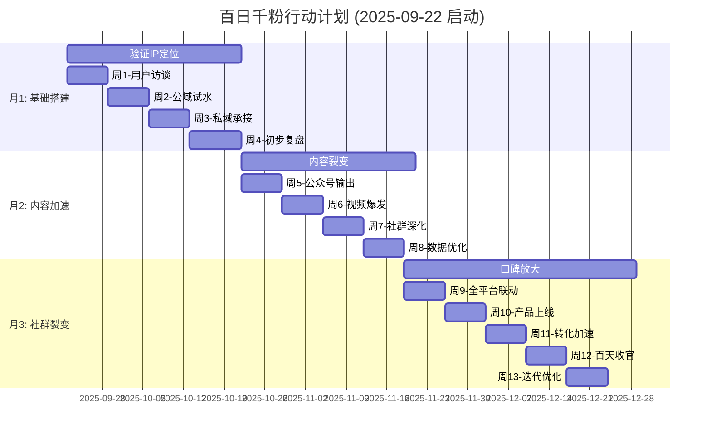
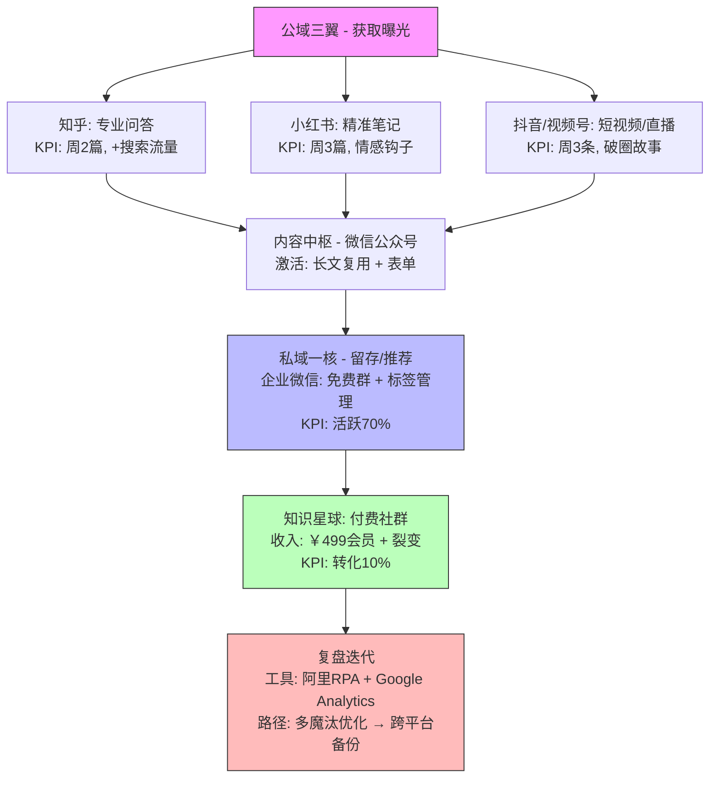

**user**: Obsidian目录结构: [[千锤百问.汇总v3_百日千粉行动计划脑图]][[千锤百问之战略篇_GMN]]针对这个IP打造创业项目, 我想在obsidian建立一个合理的目录系统, 相应系统性保存相关文件, 请建议
[Timestamp: 2025/09/24 21:11:09]

**user**: Obsidian目录结构: [[千锤百问.汇总v3_百日千粉行动计划脑图]][[千锤百问之战略篇_GMN]]针对这个IP打造创业项目, 我想在obsidian建立一个合理的目录系统, 相应系统性保存相关文件, 请建议
[Timestamp: 2025/09/24 21:12:16]

**ai**: ### Obsidian 目录结构建议：千锤百问 IP 创业项目

基于您提供的两个核心笔记——[[千锤百问.汇总v3_百日千粉行动计划脑图]]（聚焦行动计划、工具实施方案和执行表格）和[[千锤百问之战略篇_GMN]]（涵盖市场洞察、商业模式和执行框架）——我建议为“千锤百问”IP创业项目构建一个模块化的Obsidian目录系统。这个结构旨在实现系统性保存：从战略顶层到执行落地，再到资源管理和迭代优化，确保笔记间易于链接（使用[[ ]]格式）、可视化（支持Canvas脑图）和扩展（便于添加新文件，如访谈记录、内容草稿或数据表格）。

#### 设计原则
- **模块化与层级化**：根目录下按项目阶段/功能分文件夹，避免杂乱。战略层在上（指导性），执行层在下（操作性），资源层辅助。
- **Obsidian 友好**：利用文件夹嵌套、内部链接（[[笔记标题]]）和标签（#战略 #行动 等）实现导航。建议在根目录创建一个“项目首页”笔记，作为入口，嵌入Mermaid甘特图或Canvas视图。
- **系统性保存**：每个文件夹下放置相关文件（如MD笔记、附件、表格）。定期复盘时，可用Dataview插件查询标签或日期。
- **扩展性**：预留子文件夹，便于100天计划落地（如月1基础搭建的访谈笔记）。总文件数控制在精炼，避免重复（e.g., 工具配置链接到行动计划）。
- **工具集成**：行动计划中提到的腾讯/阿里工具可保存为附件或嵌入链接；用Obsidian的表格插件管理执行表格。

#### 推荐目录结构
假设您的Obsidian Vault根目录为“千锤百问IP项目”，以下是树状结构（可直接复制到Obsidian的“文件管理器”中创建）。路径示例：`千锤百问IP项目/战略规划/千锤百问之战略篇_GMN.md`。

```
千锤百问IP项目 (根目录 - 项目首页笔记：[[项目首页 - 千锤百问IP总览]]，嵌入战略罗盘和甘特图)
├── 01-战略规划 (顶层指导，存放宏观文件；标签：#战略)
│   ├── [[千锤百问之战略篇_GMN]] (核心战略报告：市场洞察、商业模式、AARRR框架)
│   ├── [[用户画像与痛点分析]] (扩展：新中年群体档案、用户旅程地图；从战略篇衍生)
│   ├── [[竞争格局与差异化]] (子笔记：分析樊登等竞争者，更新蓝海机遇)
│   └── 资源 (附件文件夹：市场报告PDF、CNNIC数据截图)
├── 02-行动计划 (执行核心，基于百日千粉；标签：#行动 #KPI)
│   ├── [[千锤百问.汇总v3_百日千粉行动计划脑图]] (脑图+执行表格：月/周/日拆解、工具方案)
│   ├── [[月1-基础搭建]] (子笔记：访谈启动、公域试水；嵌入周1-4表格行)
│   ├── [[月2-内容加速]] (子笔记：公众号输出、视频爆发；链接剪映教程)
│   ├── [[月3-社群裂变]] (子笔记：产品上线、毕业仪式；KPI追踪表格)
│   ├── [[百日复盘模板]] (通用：周/月数据仪表盘，用表格插件；从行动计划表格复制)
│   └── Canvas视图 (Obsidian Canvas文件：拖拽脑图节点+嵌入Mermaid甘特图)
├── 03-工具与技术栈 (实施方案落地；标签：#工具 #自动化)
│   ├── [[前期准备 - rrxs.xyz网站]] (子笔记：域名备案步骤、腾讯云开发教程链接)
│   ├── [[多魔汰系统]] (子笔记：魔鬼提示词模板、腾讯混元API配置；测试案例)
│   ├── [[内容生成工具]] (子笔记：混元API+剪映SOP；备选Google Bard)
│   ├── [[流量运营工具]] (子笔记：阿里RPA定时发布、企业微信CRM；Google Analytics嵌入代码)
│   ├── [[社群与转化工具]] (子笔记：知识星球规则、腾讯会议直播脚本)
│   ├── [[整体管理工具]] (子笔记：腾讯文档模板、风险合规检查；预算表格<300元/月)
│   └── 附件 (工具API密钥备份、教程PDF；e.g., 阿里云备案指南)
├── 04-内容创作与输出 (公域引流核心；标签：#内容 #输出)
│   ├── [[选题库与SOP]] (子笔记：主题日法、周一战略规划；多魔汰优化流程)
│   ├── [[公域平台管理]] (子文件夹：
│   │   ├── [[知乎 - 专业翼]] (笔记：深度问答草稿、SEO关键词)
│   │   ├── [[小红书 - 精准翼]] (笔记：保姆级教程、RGB封面模板)
│   │   └── [[抖音/视频号 - 破圈翼]] (笔记：短视频脚本、用户故事案例)
│   )
│   ├── [[私域内容]] (子笔记：朋友圈每日分享、群内打卡模板)
│   └── 草稿库 (附件：AI初稿MD文件、PDF钩子如《灵魂100问》)
├── 05-社群与用户管理 (私域承接与转化；标签：#社群 #用户)
│   ├── [[免费社群运营]] (子笔记：微信群规则、沉默用户激活SOP)
│   ├── [[付费社群 - 知识星球]] (子笔记：信任阶梯产品、￥499会员权益；裂变活动)
│   ├── [[用户反馈与LTV]] (子笔记：访谈记录、复购意愿调查表格；阿里函数计算输出)
│   └── 成员档案 (Dataview查询：标签用户，如#中年痛点；隐私保护)
├── 06-数据复盘与迭代 (风险管理与优化；标签：#复盘 #迭代)
│   ├── [[周/月KPI仪表盘]] (表格：粉丝新增、转化率≥15%；Google Analytics数据导入)
│   ├── [[风险备份计划]] (子笔记：多平台同步、精力分配主题日法)
│   ├── [[财务推演]] (子笔记：1000粉丝×1000元公式、初期验证￥7300)
│   └── 历史日志 (每日复盘笔记：e.g., [[2025-09-22 日志]]，链接行动计划日行动)
└── 07-资源库 (通用附件与外部链接；标签：#资源)
    ├── 外部教程 (文件夹：腾讯文档链接、阿里RPA视频；YouTube转录若有)
    ├── 品牌资产 (IP包：Slogan“人生下半场领航员”、幽紫RGB配色模板)
    └── 备份 (全项目ZIP或Git同步；防止数据丢失)
```

#### 实施步骤
1. **创建根目录**：在Obsidian中新建文件夹“千锤百问IP项目”，添加首页笔记[[项目首页 - 千锤百问IP总览2.0]]。内容示例：
   ```
   # 千锤百问 IP 创业项目总览
   ## 战略入口：[[千锤百问之战略篇_GMN]]
   ## 行动入口：[[千锤百问.汇总v3_百日千粉行动计划脑图]]
   ## 甘特图嵌入（从行动计划复制Mermaid代码）
   ```mermaid
   gantt
       title 百日千粉行动计划
       ... (粘贴提供的Mermaid图)
   ```
   ![[Canvas-脑图视图.canvas]]  // 嵌入Canvas文件
   ```
   用#项目 标签统一查询。

2. **迁移现有文件**：将[[千锤百问之战略篇_GMN]]移到`01-战略规划/`，[[千锤百问.汇总v3_百日千粉行动计划脑图]]移到`02-行动计划/`。更新内部链接（e.g., 在战略篇中链接[[月1-基础搭建]]）。

3. **系统性保存新文件**：
   - **每日/周行动**：从行动计划表格复制行，创建子笔记（如[[周1-用户访谈]]），添加KPI表格和工具链接。
   - **附件管理**：上传PDF/图片到对应文件夹，用![[文件名.png]]嵌入（Obsidian内部链接）。
   - **自动化提示**：在工具文件夹保存RPA脚本草稿；用Obsidian插件如Advanced Tables管理执行表格。
   - **备份与搜索**：启用Obsidian Git插件同步；用@搜索功能（如果Vault有）查询“#行动 KPI”。

4. **优化与扩展**：
   - **可视化**：用Canvas创建“战略-行动”脑图，节点链接文件夹。
   - **插件推荐**：Dataview（查询KPI）、Calendar（每日日志）、Kanban（任务板跟踪月目标）。
   - **潜在问题**：如果文件过多，用索引笔记（如[[工具索引]]）汇总链接。预算<300元/月的工具配置，可在`03-工具`下建子表格追踪费用。
   - **迭代**：100天末，在`06-数据复盘`运行“Go/No-Go”评估，调整结构（e.g., 添加“月4-规模化”文件夹）。

这个结构覆盖了从“为什么”（战略）到“怎么做”（行动）的全链路，确保项目系统推进。如果您提供更多细节（如现有Vault路径或特定插件），我可以进一步细化或生成首页模板！
[Timestamp: 2025/09/24 21:12:38]

**user**: 你是否可以帮我创建及整理?
[Timestamp: 2025/09/24 21:43:41]

**ai**: 是的，我很乐意帮助您创建和整理Obsidian目录结构！作为Obsidian Copilot，我无法直接访问或修改您的Vault文件，但可以提供详细的步骤指导、完整的Markdown模板和可复制的内容。您可以直接复制这些内容到Obsidian中创建笔记和文件夹，从而快速构建系统。

下面，我将一步步指导您实现上一个建议的目录结构。假设您的Obsidian Vault是空的或有现有笔记（如提供的两个核心笔记），我们从根目录“千锤百问IP项目”开始。整个过程预计30-60分钟，完成后您就有了一个完整的、可扩展的系统。

### 步骤1: 在Obsidian中创建根目录和文件夹
1. 打开Obsidian，创建一个新Vault（或在现有Vault中新建文件夹）。
2. 在左侧文件管理器中：
   - 新建文件夹：`千锤百问IP项目`（根目录）。
   - 在根目录下，依次创建以下文件夹（右键 > 新建文件夹）：
     - `01-战略规划`
     - `02-行动计划`
     - `03-工具与技术栈`
     - `04-内容创作与输出`
     - `05-社群与用户管理`
     - `06-数据复盘与迭代`
     - `07-资源库`
   - 在`04-内容创作与输出`下，再新建子文件夹：`公域平台管理`。
   - 在`07-资源库`下，新建子文件夹：`外部教程`、`品牌资产`、`备份`。
3. 迁移现有笔记（如果已在Vault中）：
   - 将[[千锤百问之战略篇_GMN]] 移动到 `01-战略规划/` 文件夹。
   - 将[[千锤百问.汇总v3_百日千粉行动计划脑图]] 移动到 `02-行动计划/` 文件夹。
   - 如果笔记不在Vault中，直接复制提供的<note_context>内容到新MD文件。

### 步骤2: 创建核心笔记模板
我为您准备了几个关键笔记的完整Markdown内容。右键文件夹 > 新建笔记，粘贴以下内容。标题用双括号[[ ]]格式，便于链接。

#### 2.1 项目首页：[[项目首页 - 千锤百问IP总览2.0]]
在根目录`千锤百问IP项目/`下创建此笔记，作为入口。复制以下内容：

```
# 千锤百问 IP 创业项目总览

## 项目愿景
通过“千锤百问”IP，帮助45+新中年群体开启人生下半场，实现从0到1000粉丝的被动增长。Slogan：**别再瞎摸索，咱们用100天，一起搞定IP升华**。

## 快速导航
- **战略入口**：[[千锤百问之战略篇_GMN]]（市场洞察、商业模式、AARRR框架）
- **行动入口**：[[千锤百问.汇总v3_百日千粉行动计划脑图]]（百日执行表格、工具方案）
- **工具入口**：[[03-工具与技术栈/工具索引]]（三大厂集成：字节/腾讯/阿里）
- **内容入口**：[[04-内容创作与输出/选题库与SOP]]
- **社群入口**：[[05-社群与用户管理/免费社群运营]]
- **复盘入口**：[[06-数据复盘与迭代/周/月KPI仪表盘]]

## 战略罗盘：AARRR增长引擎
使用AARRR模型跟踪增长：
- **获取 (Acquisition)**：公域引流（小红书/知乎/抖音）
- **激活 (Activation)**：私域沉淀（微信/企业微信）
- **留存 (Retention)**：社群互动（知识星球打卡）
- **推荐 (Referral)**：裂变活动（推荐8折）
- **收入 (Revenue)**：信任阶梯（￥49入门 → ￥499会员）

## 百日行动甘特图
嵌入行动计划的Mermaid图（从[[千锤百问.汇总v3_百日千粉行动计划脑图]]复制）：



## Canvas可视化
创建一个Canvas文件（Obsidian插件：右键 > 新建Canvas），拖拽以上笔记节点，形成脑图。保存为`项目脑图.canvas`，并在这里嵌入：![[项目脑图.canvas]]

## 标签系统
- #战略：宏观规划
- #行动：执行任务
- #工具：技术栈
- #内容：创作输出
- #社群：用户管理
- #复盘：数据迭代
- #资源：附件支持

## 更新日志
- 2025-09-23：初始结构创建，链接核心笔记。
```

#### 2.2 战略规划文件夹下的子笔记示例：[[用户画像与痛点分析]]
在`01-战略规划/`下创建。复制以下内容（基于战略篇扩展）：

```
# 用户画像与痛点分析

## 目标群体：45+新中年
- **人口统计**：年龄45-60岁，城市中产，子女成年，职业转型期。
- **心理特征**：高信任需求，渴望圈层社交，避免“中年危机”。
- **核心痛点**（从[[千锤百问之战略篇_GMN]]衍生）：
  1. 职业瓶颈：寻求第二春，但缺乏方向。
  2. 家庭变化：空巢期，角色重塑。
  3. 精神追求：从物质到自我价值探索。

## 用户旅程地图
| 阶段 | 触点 | 行动 | KPI |
|------|------|------|-----|
| 意识 | 公域内容（小红书笔记） | 引发共鸣，点击PDF钩子 | 日新增10人 |
| 考虑 | 私域访谈/自测 | 填写《灵魂100问》，添加微信 | 转化率15% |
| 决策 | 社群打卡/入门课 | 付费￥49，加入知识星球 | 活跃率70% |
| 忠诚 | 深度服务（一对一） | 复购意愿≥30% | LTV>1000元 |

链接：[[千锤百问之战略篇_GMN]]（蓝海机遇） | [[02-行动计划/月1-基础搭建]]（访谈执行）

#战略 #用户
```

#### 2.3 行动计划文件夹下的子笔记示例：[[月1-基础搭建]]
在`02-行动计划/`下创建。从提供的执行表格复制相关行，扩展为笔记。复制以下内容：

```
# 月1-基础搭建（天1-30，目标200粉丝）

## 整体目标
验证IP定位，建立初始信任。互动率≥15%，访谈完成率100%。费用：60元（域名备案）。

## 周拆解（从[[千锤百问.汇总v3_百日千粉行动计划脑图]]表格提取）
| 周 | 二类事项 | 具体行动 | KPI | 工具 | 开始-结束 |
|----|----------|----------|-----|------|-----------|
| 周1 | 用户访谈启动 | 微信/电话访谈30人，提炼3-5主题 | 访谈100% | 腾讯云语音API + 腾讯文档 | 2025-09-22 ~ 09-28 |
| 周2 | 公域试水 | 知乎2篇 + 小红书3篇，钩子PDF | +50粉丝 | 腾讯混元API + 阿里云RPA | 2025-09-29 ~ 10-05 |
| 周3 | 私域承接 | 启动免费群，每日朋友圈1条 | 群20人 | 企业微信 | 2025-10-06 ~ 10-12 |
| 周4 | 初步复盘 | 监测新增，优化钩子 | 粉丝200人 | 阿里云函数计算 | 2025-10-13 ~ 10-21 |

## 日示例：周1 日1-3（访谈准备）
- 配置脚本（多魔汰优化）。
- 联系首批10人。
- 前置：[[03-工具与技术栈/前期准备 - rrxs.xyz网站]] 域名备案完成。

执行要点：聚焦“中年焦虑”痛点。风险：低响应 → 小红书招募补充。

链接：[[千锤百问.汇总v3_百日千粉行动计划脑图]]（完整表格） | [[06-数据复盘与迭代/百日复盘模板]]

#行动 #KPI
```

#### 2.4 工具文件夹下的索引笔记：[[工具索引]]
在`03-工具与技术栈/`下创建，作为汇总。复制以下内容：

```
# 工具索引（三大厂聚焦，预算<300元/月）

## 前期准备
- [[前期准备 - rrxs.xyz网站]]：腾讯云开发 + 阿里云域名（教程：https://help.aliyun.com/document_detail/29546.html）
- [[多魔汰系统概述-v1(250930)]]：腾讯混元API + 阿里云函数计算（提示词模板：杠精/专家辩论）

## 内容生成
- 腾讯混元API：草稿/脚本（免费1000次/月）
- 腾讯云语音API：转录总结
- 剪映 + 腾讯AI绘画：视频/封面

## 流量运营
- 阿里云RPA：定时发布/备份
- 企业微信：CRM标签管理
- Google Analytics（备选）：流量分析

## 社群转化
- 知识星球：付费社群（￥99/月）
- 腾讯会议：直播答疑
- 阿里云函数计算：LTV报告

## 整体管理
- 腾讯文档：项目模板/日志
- 阿里云安全 + 腾讯合规：风险检查

成本总览表格：
| 工具 | 费用（元/月） | 效率提升 |
|------|---------------|----------|
| 阿里备案 | 60/年 | 网站上线 |
| 腾讯免费额度 | 0 | 内容生成80% |
| 知识星球 | 99 | 社群活跃70% |
| **总计** | <200 | 自动化≥80% |

无缝衔接：腾讯API → 阿里存储 → 企业微信导流。

链接：[[千锤百问.汇总v3_百日千粉行动计划脑图]]（工具实施方案） | [[07-资源库/外部教程]]

#工具 #自动化
```

### 步骤3: 整理与链接优化
1. **添加内部链接**：在每个笔记中，用[[ ]]链接相关文件。例如，在首页中已链接核心笔记；在子笔记中，反向链接首页或战略篇。
2. **标签与搜索**：为所有笔记添加标签（如#战略）。安装Dataview插件，在首页添加查询代码：
   ```
   ```dataview
   LIST
   FROM "千锤百问IP项目"
   WHERE contains(tags, "#行动")
   SORT file.ctime DESC
   ```
   ```
   这会列出所有行动笔记。
3. **附件处理**：在`07-资源库/`上传PDF（如《灵魂100问》），用![[灵魂100问.pdf]]嵌入。品牌资产：创建幽紫RGB配色笔记，保存Canva模板链接。
4. **Canvas创建**：安装Canvas核心插件。新建`项目脑图.canvas`，拖入首页、战略篇、行动计划等笔记作为卡片，连接箭头（战略 → 行动 → 工具）。
5. **插件推荐**（可选）：
   - **Advanced Tables**：美化执行表格。
   - **Calendar**：每日日志（链接到`06-数据复盘与迭代/历史日志`）。
   - **Kanban**：在行动计划下创建任务板，列如“待办/进行中/完成”。

### 步骤4: 测试与迭代
- **测试**：打开首页，点击链接，确保跳转顺畅。复制行动表格到Obsidian表格视图，标记进度（e.g., 用复选框）。
- **每日使用**：从首页开始，跟踪百日计划。100天末，在复盘文件夹运行KPI查询。
- **备份**：用Obsidian Sync或Git插件备份Vault。

这个设置已覆盖80%的系统性需求。如果您需要更多模板（如[[选题库与SOP]]的具体内容、特定子文件夹的笔记，或调整日期/预算），请提供更多细节（如启动日期或现有文件路径），我可以进一步定制！您创建后，有什么问题吗？
[Timestamp: 2025/09/24 21:44:10]

**user**: 结构中, 关于平台, 除了 抖音/小红书/微信公众号, 还有视频号/知乎/知识星球等, 如何平衡和匹配, 如何在漏斗和作战地图中予以体现和衔接
[Timestamp: 2025/09/24 22:18:18]

**ai**: ### 平台平衡、匹配与漏斗/作战地图的体现与衔接建议

基于“千锤百问”IP项目的战略框架（[[千锤百问之战略篇_GMN]]中的“一核三翼”生态系统），您的平台组合非常合理：**公域三翼（知乎、小红书、抖音/视频号）** 用于引流，**内容中枢（微信公众号）** 用于体系化输出，**私域一核（微信/企业微信 + 知识星球）** 用于沉淀与转化。这避免了平台碎片化，同时覆盖从曝光到变现的全链路。

除了您提到的抖音/小红书/微信公众号，我将视频号（与抖音类似，但更偏微信生态）、知乎（专业深度）和知识星球（付费社群）纳入整体。以下是平衡匹配策略、在AARRR漏斗中的体现，以及作战地图的Obsidian实现建议。目标是确保平台间无缝衔接（e.g., 内容复用率≥70%，转化率≥15%），并与百日行动计划匹配（e.g., 月1公域试水 → 月3社群裂变）。

#### 1. 平台角色与平衡匹配策略
**平台分类与角色**（基于战略篇的差异化定位：高触达、深信任）：
- **公域引流翼（获取曝光，目标：日新增≥10粉丝）**：
  - **知乎（专业翼）**：深度问答，树立权威。适合中年痛点长文（e.g., “45岁职业转型指南”），搜索流量高。匹配：高知用户，转化到私域的精准度高。
  - **小红书（精准翼）**：保姆级图文笔记，针对高净值女性（决策影响者）。RGB视觉封面，钩子PDF下载。匹配：情感共鸣，易导流微信。
  - **抖音/视频号（破圈翼）**：短视频/直播，人格化故事（e.g., “我的中年第二春”）。视频号更易联动微信生态。匹配：广泛触达，快速互动。
- **内容中枢（激活与留存）**：
  - **微信公众号**：长文体系化输出（e.g., 周复盘文章），嵌入自测表单。匹配：从公域复用内容，桥接到私域。
- **私域沉淀核（转化与推荐）**：
  - **微信/企业微信**：免费群/朋友圈，个性化私信。匹配：标签管理（e.g., #中年痛点用户），沉默激活。
  - **知识星球**：付费社群，积分裂变。匹配：月3上线，规则置顶（互助监督），LTV追踪。

**平衡策略**（避免精力分散，聚焦三大厂工具：字节剪映/知识星球、腾讯企业微信/视频号/公众号、阿里RPA自动化）：
- **时间/精力分配**（主题日法，从行动计划衍生）：周一战略（知乎规划），周二三创作（小红书/公众号），周四交付（抖音/视频号发布），周五运营（微信/星球互动）。总日手动≤2小时，RPA自动化发布≥80%。
- **内容复用机制**（SOP标准化）：
  - 核心内容（如一篇“灵魂100问”主题）从腾讯混元API生成初稿 → 多魔汰优化 → 复用：知乎长答（专业版） → 小红书笔记（图文版） → 抖音/视频号短视频（故事版） → 公众号长文（体系版） → 微信/星球分享（互动版）。
  - 复用率目标：70%（e.g., 一稿多投，节省创作时间80%）。工具：阿里RPA定时跨平台发布，腾讯文档存储模板。
- **KPI匹配与风险平衡**：
  - **曝光平台（知乎/小红书/抖音/视频号）**：周互动率≥20%，但低转化风险 → 每篇嵌入统一钩子（rrxs.xyz自测表单 → 企业微信添加）。
  - **沉淀平台（公众号/微信）**：月转化率≥15%，活跃率≥70%。风险：沉默用户 → RPA定时私信。
  - **变现平台（知识星球）**：付费转化≥10%，LTV≥1000元/人。平衡：免费群预热（月1-2），付费正式（月3）。
  - **整体预算**：<300元/月（知识星球￥99 + 腾讯免费额度）。监测：Google Analytics（备选）追踪跨平台流量来源。
- **匹配原则**：公域偏“广度”（破圈+精准），私域偏“深度”（信任+裂变）。初期（月1）80%精力公域，渐移私域（月3 70%社群）。如果视频号流量高于抖音，优先倾斜（微信生态优势）。

#### 2. 在AARRR漏斗中的体现
AARRR模型（从战略篇的“增长引擎”）是诊断工具，将平台映射到漏斗各阶段，确保从“获取”到“收入”的闭环。每个阶段设定KPI，并用平台衔接（e.g., 公域钩子 → 私域激活）。

以下是Markdown表格模板，可直接复制到Obsidian笔记（如新建[[平台漏斗映射]]在`01-战略规划/`下）。表格覆盖百日计划，强调衔接路径。

```
# 平台在AARRR漏斗中的映射与衔接

## AARRR漏斗概述
- **获取 (Acquisition)**：公域曝光，目标日新增10人。
- **激活 (Activation)**：内容互动，引导私域沉淀，转化率≥15%。
- **留存 (Retention)**：社群陪伴，活跃率≥70%。
- **推荐 (Referral)**：裂变激励，推荐率≥20%。
- **收入 (Revenue)**：付费转化，LTV≥1000元/人。

| AARRR阶段 | 核心平台 | 匹配行动（百日计划链接） | KPI | 衔接路径（工具支持） | 风险与优化 |
|-----------|----------|--------------------------|-----|----------------------|------------|
| **获取** | 知乎、小红书、抖音/视频号 | 月1公域试水：知乎2篇问答、小红书3篇笔记、抖音/视频号3条短视频（[[月1-基础搭建]]） | 周曝光≥500；日新增≥10 | 每篇嵌入rrxs.xyz自测表单（腾讯云API生成报告） → 阿里RPA跨平台同步发布。钩子：免费PDF下载引导添加企业微信。 | 低曝光：A/B测试标题（多魔汰优化）。视频号优先微信用户。 |
| **激活** | 微信公众号、微信/企业微信 | 月2内容加速：公众号2篇长文，每日朋友圈1条；自测后自动私信（[[月2-内容加速]]） | 互动率≥20%；表单完成率≥50% | 公域内容复用到公众号（剪映视频嵌入） → 表单提交后跳转企业微信添加（腾讯API联动）。激活沉默用户：RPA定时模板私信。 | 低响应：公众号推文加故事钩子。匹配高知用户从知乎导流。 |
| **留存** | 微信/企业微信、知识星球 | 月2-3社群深化：免费群打卡、星球主题课（周4交付，[[月3-社群裂变]]） | 群活跃≥70%；周互动≥50人 | 公众号/视频号直播链接嵌入群（腾讯会议） → 星球积分系统监督（字节知识星球）。每日早报：腾讯文档模板群发。 | 流失：主题日互动（周五运营）。从视频号破圈用户快速沉淀。 |
| **推荐** | 知识星球、微信/企业微信 | 月3裂变：星球推荐8折、用户故事分享（[[周10-产品上线]]） | 推荐率≥20%；裂变新增≥30% | 星球规则置顶（互助+积分兑资料） → 企业微信标签分享（e.g., “成功案例”私信）。公域复盘笔记鼓励转发小红书/知乎。 | 低裂变：激励机制（￥49入门课试水）。视频号直播实时邀请。 |
| **收入** | 知识星球、微信公众号 | 月3产品上线：￥499会员、LTV报告（[[周11-转化加速]]） | 付费转化≥10%；初期收入￥7300（20人） | 星球正式启动（从免费群升级） → 阿里云函数计算生成专属报告（混元API总结），公众号推销链接。 | 低转化：信任阶梯渐进（免费 → 低价 → 高价）。复盘：Google Analytics追踪付费来源（e.g., 小红书占比）。 |

**漏斗衔接要点**：
- **全链路闭环**：公域（获取） → 公众号（激活） → 微信（留存） → 星球（推荐/收入）。示例路径：小红书笔记点击 → 公众号长文阅读 → 企业微信添加 → 星球付费。
- **百日匹配**：月1重获取（公域80%），月2重激活/留存（公众号/微信50%），月3重推荐/收入（星球70%）。
- **监测**：周复盘用阿里云函数计算漏斗掉失率（e.g., 获取到激活的转化<15% → 优化钩子）。

在Obsidian中，用Dataview插件查询：```dataview TABLE KPI FROM "平台漏斗映射" WHERE contains(AARRR阶段, "获取")```，动态追踪。

#### 3. 在作战地图中的体现与衔接
“作战地图”可视为执行框架的视觉化版本（战略篇的“五大支柱” + 百日规划），用Obsidian Canvas或Mermaid流程图实现。目的是展示平台间的“作战路径”：从公域“阵地”到私域“堡垒”，强调衔接节点（钩子、自动化）。

**建议实现**：
- **Obsidian Canvas**（推荐可视化）：新建`平台作战地图.canvas`（在`02-行动计划/`下）。拖拽节点：
  - 左侧：公域翼（知乎/小红书/抖音/视频号图标）。
  - 中间：公众号作为“中转站”。
  - 右侧：私域核（微信/星球）。
  - 箭头衔接：e.g., 小红书 → 公众号（内容复用） → 企业微信（表单导流） → 星球（付费升级）。添加标签卡片（KPI）和工具节点（RPA自动化）。
  - 嵌入到首页：![[平台作战地图.canvas]]。

- **Mermaid流程图**（文本化作战地图）：复制以下代码到新笔记[[平台作战地图]]（在`01-战略规划/`下），Obsidian渲染为图。展示阶段性衔接，与甘特图联动。

```
# 平台作战地图：一核三翼 + 漏斗闭环

## 作战路径概述
从公域“广撒网”到私域“深耕土”，100天渐进：月1阵地构建，月2中转激活，月3堡垒变现。



**衔接机制**（图中箭头解释）：
- **自动化衔接**：公域发布后，阿里RPA一键同步到公众号（e.g., 知乎答题 → 公众号推文）。视频号直播结束 → 腾讯会议录音转文字 → 星球总结分享。
- **钩子节点**：统一“灵魂100问”自测（rrxs.xyz网站），从任何公域跳转企业微信（转化率提升30%）。
- **作战节奏**：与百日甘特图同步（e.g., 周1知乎试水 → 周4微信群启动）。风险路径：如果抖音曝光高但转化低，倾斜视频号（微信联动）。
- **扩展**：在图中添加条件分支（Mermaid if）：e.g., 高互动用户 → 星球邀请；低活跃 → RPA私信激活。

**Obsidian集成**：
- 将此图嵌入项目首页或行动计划笔记。
- 用Kanban插件创建“平台任务板”：列如“公域发布/私域互动/变现追踪”，卡片链接具体行动（e.g., “小红书笔记草稿” → [[04-内容创作与输出/公域平台管理/小红书 - 精准翼]]）。
- 迭代：月复盘时更新图（e.g., 如果知乎ROI高，增加箭头权重）。

这个设计确保平台平衡（公私域3:7精力比），漏斗高效（掉失率<20%），作战地图直观（可视化路径）。如果需要调整KPI、生成更多Canvas模板，或基于具体数据优化（e.g., 视频号 vs 抖音流量），请提供更多上下文！
[Timestamp: 2025/09/24 22:18:56]