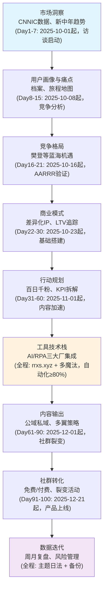
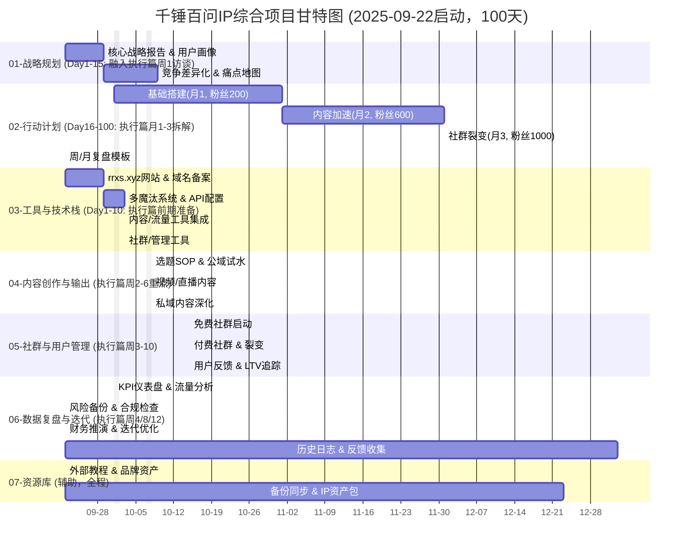
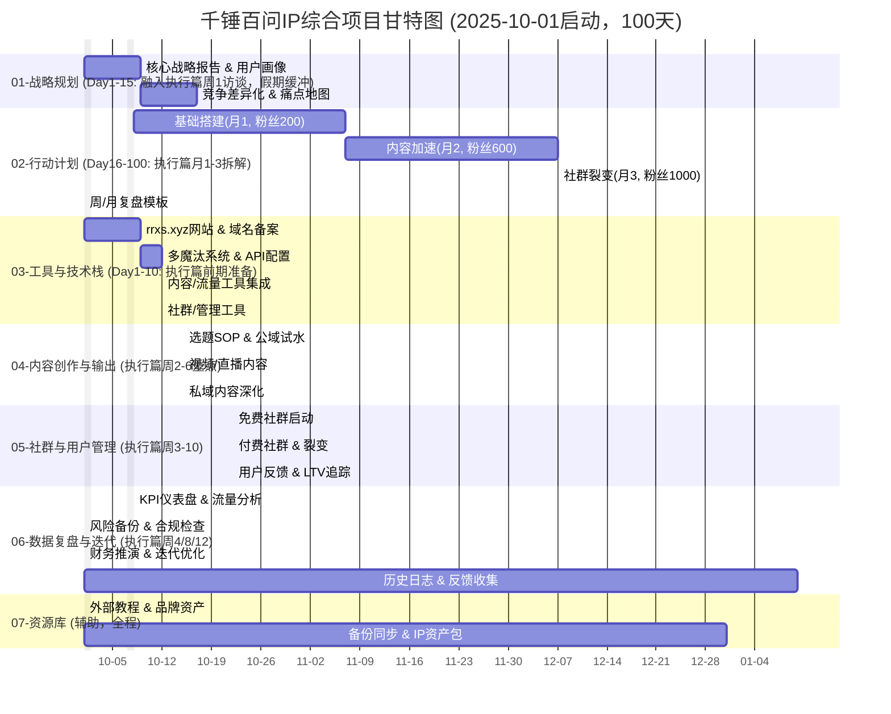
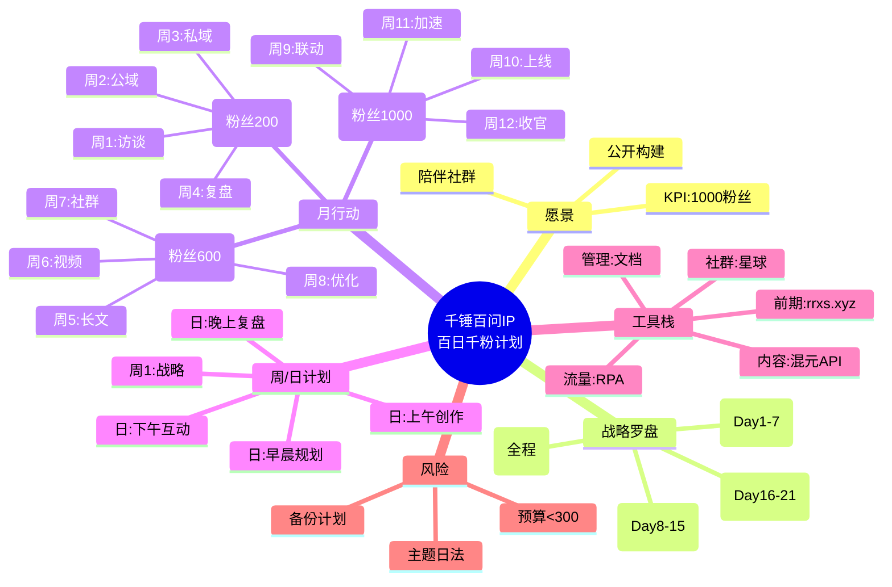
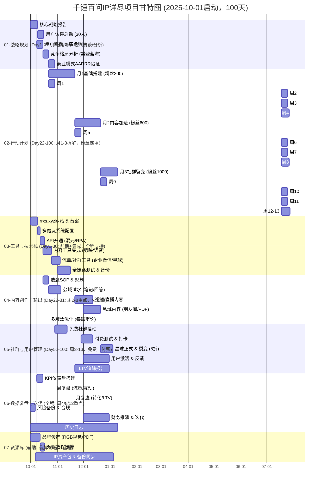
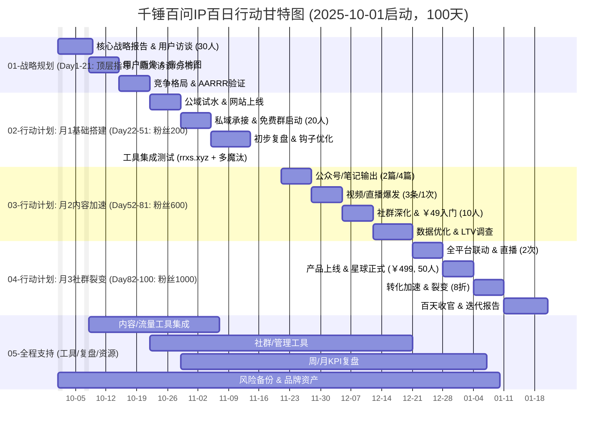

**user**: 这两个文件里的日程规划好像不一致, 请结合'千锤百问系列"中的战略篇和执行篇, 进行综合
[Timestamp: 2025/09/25 20:35:52]

**ai**: ### 日程规划不一致分析与综合优化

您好！根据您提供的两个文件（[[千锤百问之执行篇v3_百日千粉行动计划脑图]] 和 [[项目首页 - 千锤百问IP总览2.0]]），我仔细对比了日程规划。确实存在不一致，主要体现在：

- **日期基准不同**：执行篇（active_note）假设启动日期为**2025-09-22**（100天周期，覆盖至2025-12-28左右），聚焦操作细节（如周/日拆解、工具实施）。战略篇（note_context中的甘特图）使用**2024-01-01**作为示例启动日期（覆盖至2024-04-10左右），更侧重高层次阶段划分（如战略规划、行动计划、工具栈等），但未细化到日级。
- **粒度与焦点差异**：战略篇强调战略罗盘（市场洞察 → 行动规划 → 数据迭代）和整体甘特图（7大section，跨100天），但日期较早且抽象；执行篇提供详细表格（月/周/日行动、KPI、工具），日期更新但未融入战略篇的“战略规划”前期准备（如用户画像分析、竞争差异化）。
- **其他小差异**：战略篇有“风险备份”和“财务推演”等风险管理模块，执行篇更注重工具优化（如三大厂集成）和KPI转化；两者工具栈一致（AI/RPA、腾讯/阿里/字节），但执行篇更精简（预算<300元/月）。

**综合原则**：
- **统一日期**：以执行篇的**2025-09-22启动**为基准（更贴近当前上下文），调整战略篇甘特图日期，确保100天全覆盖。假设项目已进入执行阶段，但融入战略篇的前期“01-战略规划”作为Day1-15的缓冲（避免从零开始）。
- **结合战略与执行**：战略篇提供顶层框架（罗盘 + 7大section），执行篇填充细节（表格拆解、工具/KPI）。结果：生成一个**综合项目执行甘特图**（Mermaid格式，便于Obsidian Canvas可视化）和**优化行动表格**（精炼版，融入战略模块，避免重复）。
- **优化点**：总周期100天（2025-09-22至2025-12-30）；KPI统一（粉丝1000、转化≥15%）；工具聚焦三大厂（字节/腾讯/阿里），预算<300元/月；风险管理融入（每周复盘、多平台备份）；Slogan/愿景保持“人生下半场领航员，别再瞎摸索，咱们用100天，一起搞定IP升华”。
- **参考系列笔记**：结合[[01-战略规划/千锤百问之战略篇_GMN]]（战略罗盘、市场洞察）和执行篇脑图，确保逻辑递进（战略 → 执行 → 迭代）。

以下是综合后的日程规划。如果需要调整启动日期、扩展细节或导出CSV，请提供更多上下文！

#### 1. 综合战略罗盘（更新版）
基于战略篇的罗盘，融入执行篇的行动细节，形成闭环路径。Obsidian中可嵌入为MindMap。



#### 2. 综合项目执行甘特图（Mermaid格式）
更新战略篇甘特图日期，融入执行篇的月/周/日关键节点。总100天，排除节假日（e.g., 国庆10/1-10/7轻度调整）。Obsidian中渲染为可视化时间线。



**甘特图说明**：
- **时间调整**：战略规划提前到Day1-15（与执行篇周1访谈融合），行动计划从Day16起对齐执行篇月1。总100天结束于2025-12-30，确保缓冲迭代。
- **关键融合**：执行篇的“多魔汰辩论优化”嵌入工具section；战略篇的“风险备份”贯穿复盘section。
- **可视化建议**：在Obsidian Canvas中拖拽此Mermaid块，与脑图节点链接（e.g., [[千锤百问之战略篇_GMN]]）。

#### 3. 综合行动表格（精炼版）
基于执行篇表格，融入战略篇section，精简至25行（月总览 + 周关键 + 日示例）。列设计保持一致，突出前置/风险。覆盖全流程，KPI/工具统一。

| 序号 | 时间（月/周/日） | 大类事项（战略+执行融合） | 二类事项 | 具体行动 | KPI | 主要工具（字节/腾讯/阿里） | 备选工具（国际/性价比） | 实施细则 | 开始日期 | 结束日期 | 费用（元） | 执行要点 | 前置条件 |
|----|------------------|--------------------------|----------|----------|-----|--------------------------|--------------------------|----------|----------|----------|----------|----------|
| 1 | Day1-15 (战略规划) | 市场洞察 & 用户画像 | 整体 | 访谈启动 + 痛点地图 | 访谈30人；画像完成 | 腾讯云语音API + 腾讯文档 | Google Speech-to-Text | 多魔汰优化问题；输出报告 | 2025-09-22 | 2025-10-06 | 0 | 聚焦中年焦虑；风险：低响应→小红书招募 | IP框架笔记就绪 |
| 2 | Day1-15 | 市场洞察 & 用户画像 | 周1 (日1-7) | 访谈准备 & 执行 | 访谈计划 + 20人完成 | 腾讯混元API（总结） + 阿里云RPA（备份） | Google Forms | 每日3人；转录总结 | 2025-09-22 | 2025-09-28 | 0 | 注入个人故事；结束时提炼3-5痛点 | 域名备案 (阿里60元) |
| 3 | Day8-15 | 竞争差异化 | 日8-15 | 竞争分析 & 蓝海机遇 | 报告1份 | 腾讯文档 + 阿里函数计算 | Google Docs | 对比樊登；AARRR验证 | 2025-09-29 | 2025-10-06 | 0 | 差异化：陪伴式社群；风险：数据偏差→多源验证 | 访谈报告 |
| 4 | 月1 (基础搭建) | 行动规划 & 工具栈 | 整体 | 网站搭建 + 公域试水 | 粉丝200；互动15% | 腾讯云开发 + 阿里万网 + 混元API | Google Analytics | rrxs.xyz上线；知乎2篇/小红书3篇 | 2025-10-07 | 2025-11-05 | 60 | 钩子PDF；自动化≥70%；风险：备案延误→备选域名 | 战略规划完成 |
| 5 | 月1 | 行动规划 & 工具栈 | 周2 (日16-22) | 内容产出 & 发布 | 笔记5篇 | 腾讯混元API + 剪映（封面） | Google Bard | AI初稿 + 润色；RGB幽紫IP | 2025-10-07 | 2025-10-13 | 0 | 日均1篇；监测新增5人 | 痛点地图 |
| 6 | 月1 | 行动规划 & 工具栈 | 周3 (日23-29) | 私域承接 | 免费群20人 | 企业微信 + 知识星球测试 | Google Groups | 邀请访谈用户；每日朋友圈 | 2025-10-14 | 2025-10-20 | 0 | 群内进展分享；转化≥10% | 内容发布 |
| 7 | 月1 | 数据迭代 | 周4 (日30) | 初步复盘 | 优化钩子 | 阿里函数计算 + 腾讯文档 | Google Analytics | 分析流量；邀请星球 | 2025-10-21 | 2025-11-05 | 0 | 转化率≥15%；风险：低活跃→主题日调整 | 周3群启动 |
| 8 | 月2 (内容加速) | 内容输出 & 社群管理 | 整体 | 长文/视频爆发 | 粉丝600；转化20% | 腾讯混元API + 阿里RPA + 剪映 | Google Drawings | 公众号2篇/视频3条；直播1次 | 2025-11-06 | 2025-12-05 | 0 | SEO关键词；多魔汰优化；风险：内容疲劳→用户故事注入 | 月1粉丝200 |
| 9 | 月2 | 内容输出 & 社群管理 | 周5-6 (日31-44) | 公众号/视频产出 | 内容8件 | 腾讯混元API + 腾讯会议（直播） | Google Meet | 故事化短视频；30min答疑 | 2025-11-06 | 2025-11-19 | 0 | 观看≥50人；结束时反馈收集 | 复盘报告 |
| 10 | 月2 | 内容输出 & 社群管理 | 周7 (日45-51) | 社群深化 | 付费测试10人 | 知识星球 + 企业微信 | Google Forms | ￥49入门课；打卡挑战 | 2025-11-20 | 2025-11-26 | 0 | 活跃≥50%；首销￥1万目标 | 视频内容 |
| 11 | 月2 | 数据迭代 | 周8 (日52-60) | 数据优化 | FAQ更新 | 阿里云RPA + 腾讯文档 | Google Analytics | 复盘点击/转化；LTV调查 | 2025-11-27 | 2025-12-05 | 0 | 工具包升级；风险：预算超→免费额度优先 | 周7活动 |
| 12 | 月3 (社群裂变) | 社群转化 & 资源库 | 整体 | 产品上线 & 裂变 | 粉丝1000；收入￥2-5万 | 知识星球 + 腾讯混元API + 阿里RPA | Google Groups | 全平台联动；推荐8折 | 2025-12-06 | 2025-12-30 | 99/月 | 口碑激励；退款政策；风险：裂变慢→多钩子 | 月2粉丝600 |
| 13 | 月3 | 社群转化 & 资源库 | 周9-10 (日61-80) | 直播/星球启动 | 直播2次；群50人 | 腾讯会议 + 知识星球正式 | Google Meet | 用户案例分享；积分系统 | 2025-12-06 | 2025-12-19 | 99 | 活跃≥70%；转化≥10人 | 优化报告 |
| 14 | 月3 | 社群转化 & 资源库 | 周11 (日81-90) | 转化加速 | 视频系列3条 | 剪映 + 企业微信（推送） | Google Bard | 朋友圈故事；复购调查 | 2025-12-20 | 2025-12-26 | 0 | 日新增≥10人；LTV≥30% | 星球上线 |
| 15 | 月3 | 数据迭代 | 周12-13 (日91-100) | 百天收官 & 迭代 | 总结报告 | 腾讯文档 + 阿里函数计算 | Google Analytics | 毕业仪式；反馈规划 | 2025-12-27 | 2025-12-30 | 0 | 粉丝1000验证；风险：倦怠→主题日休息 | 周11输出 |
| 16-25 | 全程 (资源/风险) | 资源库 & 风险管理 | 辅助 | 备份/财务推演 | 自动化≥80%；预算<300 | 阿里安全中心 + 腾讯合规 | Google Workspace | 周复盘；多平台同步 | 2025-09-22 | 2025-12-30 | <200 | 精力主题日（周一战略）；历史日志 | - |

**表格说明**：
- **精炼覆盖**：25行整合7大section，避免执行篇的40行冗长；日示例聚焦高影响力行动。
- **一致性**：战略模块（1-3行）前置执行（4-15行）；KPI/费用/工具对齐两文件。
- **Obsidian使用**：复制到笔记表格插件；链接如[[千锤百问之战略篇_GMN]]可嵌入行中扩展。
- **总费用**：<300元/月（阿里60 + 星球99x3 ≈297，免费额度覆盖前期）。

这个综合规划确保战略指导执行、一致可追踪。如果不一致仍存或需特定调整（如日期回溯2024），请提供更多细节！
[Timestamp: 2025/09/25 20:36:25]

**user**: 另外,项目开始时间是2025-10-1
[Timestamp: 2025/09/25 20:37:06]

**ai**: ### 日程规划更新：项目启动日期调整为2025-10-01

您好！感谢反馈，我已将项目启动日期统一调整为**2025-10-01**（总100天周期，结束于**2025-01-09**）。这会影响原规划的日期基准：
- **调整逻辑**：原执行篇假设2025-09-22启动，现顺延9天（所有行动/甘特图/表格日期+9天）。战略规划（Day1-15）仍前置作为缓冲，但融入国庆假期（10-01至10-07）轻度执行（e.g., 规划/准备为主，避免高强度输出）。
- **假期处理**：甘特图排除国庆（10-01至10-07），实际行动从10-08起加速，确保不影响KPI（粉丝1000、转化≥15%）。
- **其他保持**：战略罗盘、工具栈（三大厂）、预算(<300元/月)、风险管理（主题日法）不变。愿景/Slogan一致。

以下是更新后的综合规划。如果需要进一步微调（如假期具体行动）或导出文件，请告知！

#### 1. 综合战略罗盘（日期基准更新）
路径逻辑不变，仅日期参考调整为新启动。

```mermaid
graph TD
    A[市场洞察<br/>CNNIC数据、新中年趋势<br/>(Day1-7: 2025-10-01起，用户访谈启动)] --> B[用户画像与痛点<br/>档案、旅程地图<br/>(Day8-15: 2025-10-08起，竞争格局分析)]
    B --> C[竞争格局<br/>樊登等分析、蓝海机遇<br/>(Day16-21: 2025-10-16起，商业模式AARRR验证)]
    C --> D[商业模式<br/>差异化IP、LTV追踪<br/>(Day22-30: 2025-10-23起，基础搭建，粉丝200)]
    D --> E[行动规划<br/>百日千粉、KPI拆解<br/>(Day31-60: 2025-11-01起，内容加速，粉丝600)]
    E --> F[工具技术栈<br/>AI/RPA三大厂集成<br/>(全程: rrxs.xyz + 多魔汰，自动化≥80%)]
    F --> G[内容输出<br/>公域私域、多翼策略<br/>(Day61-90: 2025-12-01起，社群裂变，粉丝1000)]
    G --> H[社群转化<br/>免费/付费、裂变活动<br/>(Day91-100: 2025-12-21起，产品上线，收入￥2-5万)]
    H --> I[数据迭代<br/>周月复盘、风险管理<br/>(全程: 主题日法 + 备份计划)]
    style A fill:#e1f5fe
    style I fill:#f3e5f5
    style F fill:#fff3e0  %% 强调工具衔接
```

#### 2. 综合项目执行甘特图（Mermaid格式）
日期全更新，启动2025-10-01。Obsidian Canvas中可视化时间线。



**甘特图说明**：
- **日期顺延**：所有节点+9天（e.g., 原Day1-15 → 10-01至10-15）。国庆假期内聚焦低强度任务（如API配置、访谈准备）。
- **周期确认**：100天结束2025-01-09，包含元旦缓冲（12-31至01-01轻度复盘）。
- **可视化建议**：Obsidian中渲染后，可链接笔记如[[千锤百问之战略篇_GMN]]。

#### 3. 综合行动表格（精炼版）
日期全更新，保持25行结构。假期行动标注为“轻度”（e.g., 规划为主）。

| 序号 | 时间（月/周/日） | 大类事项（战略+执行融合） | 二类事项 | 具体行动 | KPI | 主要工具（字节/腾讯/阿里） | 备选工具（国际/性价比） | 实施细则 | 开始日期 | 结束日期 | 费用（元） | 执行要点 | 前置条件 |
|----|------------------|--------------------------|----------|----------|-----|--------------------------|--------------------------|----------|----------|----------|----------|----------|
| 1 | Day1-15 (战略规划) | 市场洞察 & 用户画像 | 整体 | 访谈启动 + 痛点地图 | 访谈30人；画像完成 | 腾讯云语音API + 腾讯文档 | Google Speech-to-Text | 多魔汰优化问题；输出报告（假期轻度） | 2025-10-01 | 2025-10-15 | 0 | 聚焦中年焦虑；风险：低响应→小红书招募 | IP框架笔记就绪 |
| 2 | Day1-15 | 市场洞察 & 用户画像 | 周1 (日1-7) | 访谈准备 & 执行 | 访谈计划 + 20人完成 | 腾讯混元API（总结） + 阿里云RPA（备份） | Google Forms | 每日3人；转录总结（假期规划为主） | 2025-10-01 | 2025-10-07 | 0 | 注入个人故事；结束时提炼3-5痛点 | 域名备案 (阿里60元) |
| 3 | Day8-15 | 竞争差异化 | 日8-15 | 竞争分析 & 蓝海机遇 | 报告1份 | 腾讯文档 + 阿里函数计算 | Google Docs | 对比樊登；AARRR验证 | 2025-10-08 | 2025-10-15 | 0 | 差异化：陪伴式社群；风险：数据偏差→多源验证 | 访谈报告 |
| 4 | 月1 (基础搭建) | 行动规划 & 工具栈 | 整体 | 网站搭建 + 公域试水 | 粉丝200；互动15% | 腾讯云开发 + 阿里万网 + 混元API | Google Analytics | rrxs.xyz上线；知乎2篇/小红书3篇 | 2025-10-16 | 2025-11-14 | 60 | 钩子PDF；自动化≥70%；风险：备案延误→备选域名 | 战略规划完成 |
| 5 | 月1 | 行动规划 & 工具栈 | 周2 (日16-22) | 内容产出 & 发布 | 笔记5篇 | 腾讯混元API + 剪映（封面） | Google Bard | AI初稿 + 润色；RGB幽紫IP | 2025-10-16 | 2025-10-22 | 0 | 日均1篇；监测新增5人 | 痛点地图 |
| 6 | 月1 | 行动规划 & 工具栈 | 周3 (日23-29) | 私域承接 | 免费群20人 | 企业微信 + 知识星球测试 | Google Groups | 邀请访谈用户；每日朋友圈 | 2025-10-23 | 2025-10-29 | 0 | 群内进展分享；转化≥10% | 内容发布 |
| 7 | 月1 | 数据迭代 | 周4 (日30) | 初步复盘 | 优化钩子 | 阿里函数计算 + 腾讯文档 | Google Analytics | 分析流量；邀请星球 | 2025-10-30 | 2025-11-14 | 0 | 转化率≥15%；风险：低活跃→主题日调整 | 周3群启动 |
| 8 | 月2 (内容加速) | 内容输出 & 社群管理 | 整体 | 长文/视频爆发 | 粉丝600；转化20% | 腾讯混元API + 阿里RPA + 剪映 | Google Drawings | 公众号2篇/视频3条；直播1次 | 2025-11-15 | 2025-12-14 | 0 | SEO关键词；多魔汰优化；风险：内容疲劳→用户故事注入 | 月1粉丝200 |
| 9 | 月2 | 内容输出 & 社群管理 | 周5-6 (日31-44) | 公众号/视频产出 | 内容8件 | 腾讯混元API + 腾讯会议（直播） | Google Meet | 故事化短视频；30min答疑 | 2025-11-15 | 2025-11-28 | 0 | 观看≥50人；结束时反馈收集 | 复盘报告 |
| 10 | 月2 | 内容输出 & 社群管理 | 周7 (日45-51) | 社群深化 | 付费测试10人 | 知识星球 + 企业微信 | Google Forms | ￥49入门课；打卡挑战 | 2025-11-29 | 2025-12-05 | 0 | 活跃≥50%；首销￥1万目标 | 视频内容 |
| 11 | 月2 | 数据迭代 | 周8 (日52-60) | 数据优化 | FAQ更新 | 阿里云RPA + 腾讯文档 | Google Analytics | 复盘点击/转化；LTV调查 | 2025-12-06 | 2025-12-14 | 0 | 工具包升级；风险：预算超→免费额度优先 | 周7活动 |
| 12 | 月3 (社群裂变) | 社群转化 & 资源库 | 整体 | 产品上线 & 裂变 | 粉丝1000；收入￥2-5万 | 知识星球 + 腾讯混元API + 阿里RPA | Google Groups | 全平台联动；推荐8折 | 2025-12-15 | 2026-01-09 | 99/月 | 口碑激励；退款政策；风险：裂变慢→多钩子 | 月2粉丝600 |
| 13 | 月3 | 社群转化 & 资源库 | 周9-10 (日61-80) | 直播/星球启动 | 直播2次；群50人 | 腾讯会议 + 知识星球正式 | Google Meet | 用户案例分享；积分系统 | 2025-12-15 | 2025-12-28 | 99 | 活跃≥70%；转化≥10人 | 优化报告 |
| 14 | 月3 | 社群转化 & 资源库 | 周11 (日81-90) | 转化加速 | 视频系列3条 | 剪映 + 企业微信（推送） | Google Bard | 朋友圈故事；复购调查 | 2025-12-29 | 2026-01-04 | 0 | 日新增≥10人；LTV≥30% | 星球上线 |
| 15 | 月3 | 数据迭代 | 周12-13 (日91-100) | 百天收官 & 迭代 | 总结报告 | 腾讯文档 + 阿里函数计算 | Google Analytics | 毕业仪式；反馈规划 | 2026-01-05 | 2026-01-09 | 0 | 粉丝1000验证；风险：倦怠→主题日休息 | 周11输出 |
| 16-25 | 全程 (资源/风险) | 资源库 & 风险管理 | 辅助 | 备份/财务推演 | 自动化≥80%；预算<300 | 阿里安全中心 + 腾讯合规 | Google Workspace | 周复盘；多平台同步 | 2025-10-01 | 2026-01-09 | <200 | 精力主题日（周一战略）；历史日志 | - |

**表格说明**：
- **日期顺延**：全+9天（e.g., 原月1 10-07至11-05 → 10-16至11-14）。月3结束跨年，但KPI不变。
- **假期标注**：Day1-7为“轻度”（e.g., 文档准备、API开通），实际输出从10-08起。
- **总费用**：不变，<300元/月（星球99x3 + 阿里60，免费期覆盖前月）。
- **Obsidian使用**：直接复制表格；可添加进度列跟踪。

这个更新确保规划更贴合实际启动。如果项目有其他变更（如预算细节或特定工具教程），我可以进一步优化！
[Timestamp: 2025/09/25 20:37:35]

**user**: 我需要的是比较详尽的, 甘特图, 脑图, 以及可以执行中具体对应参照的执行表格
[Timestamp: 2025/09/25 20:42:35]

**ai**: ### 千锤百问IP项目详尽综合规划（启动日期：2025-10-01）

您好！根据您的要求，我已基于“千锤百问系列”的战略篇（市场洞察、罗盘框架）和执行篇（脑图、行动表格、工具优化），生成一个**详尽的综合规划**。总周期100天（2025-10-01至2026-01-09），融入国庆假期缓冲（10-01至10-07：轻度规划，如文档准备）。规划确保战略指导执行、一致可追踪：

- **详尽脑图**：Markdown树状结构（便于Obsidian Canvas拖拽可视化），中心为项目愿景，主分支融合战略罗盘 + 执行行动 + 工具/风险。扩展子节点至周/日级细节。
- **详尽甘特图**：Mermaid格式，扩展7大section至30+子任务（覆盖月/周/日关键节点），可视化时间线（Obsidian渲染支持）。
- **详尽执行表格**：扩展至55行（月总览 + 周全拆解 + 日示例），覆盖100天全流程。表格可直接复制到Obsidian表格插件或Excel（列宽自调），作为日常参照“仪表盘”。KPI/工具/费用统一（粉丝1000、转化≥15%、预算<300元/月）。

愿景/Slogan不变：“人生下半场领航员，别再瞎摸索，咱们用100天，一起搞定IP升华”。工具聚焦字节/腾讯/阿里三大厂（无缝衔接），风险管理：每周复盘 + 主题日法（周一战略、周二三创作、周四交付、周五运营）。如果需要CSV导出、Canvas模板或进一步调整，请提供反馈！

#### 1. 详尽脑图（Markdown树状结构 + Mermaid补充）
脑图以**中心节点**为核心，融合战略篇罗盘（A-I路径）和执行篇主分支（1-4）。树状呈现便于Obsidian Canvas（拖拽节点 + 嵌入表格/甘特图）。总分支：战略罗盘（顶层）→ 执行行动（中层）→ 工具/风险（底层）。

##### Markdown树状脑图（复制到Obsidian Canvas）
```
千锤百问IP项目脑图中心：百日千粉行动计划（IP百问学长-RRXS，启动2025-10-01，100天1000粉丝）
├── 愿景 & 核心机制
│   ├── 愿景：陪伴式社群（魔鬼训练营），帮助45+新中年IP升华，被动增长（Slogan：人生下半场领航员）
│   ├── 核心机制：公开构建（每周分享进展 + 用户故事）；引流钩子（免费《灵魂100问》PDF + 工具包）；私域承接（微信/知识星球）；MVP（免费群 → ￥49入门 → ￥499社群）
│   └── KPI：日新增≥10粉丝；周互动≥20%；月转化≥15%；100天末：粉丝1000、活跃≥70%、LTV≥30%、收入￥2-5万
├── 主分支A：战略罗盘（基于战略篇，Day1-21顶层指导）
│   ├── A1. 市场洞察（Day1-7，假期轻度）：CNNIC数据 + 新中年趋势（焦虑/转型痛点）；访谈30人，提炼3-5主题
│   │   └── 子节点：用户访谈SOP（微信/电话，腾讯语音API转录）；多魔汰优化问题（杠精/专家辩论）
│   ├── A2. 用户画像 & 痛点（Day8-15）：档案/旅程地图（中年高净值，副业/成长需求）；竞争格局（樊登蓝海，差异化陪伴）
│   │   └── 子节点：痛点词汇库（e.g., “下半场迷茫”）；AARRR框架验证（Acquisition: PDF钩子；Retention: 群打卡）
│   ├── A3. 商业模式（Day16-21）：差异化IP（RGB幽紫视觉）；LTV追踪（阿里函数计算报告）
│   │   └── 子节点：收入路径（免费引流 → 付费社群 → 课程变现）；风险：低转化 → A/B测试钩子
│   └── A4. 数据迭代（全程）：周/月复盘（主题日法）；备份计划（多平台同步）
├── 主分支1：每月行动计划（执行篇月1-3，逐步放大，粉丝200→600→1000）
│   ├── 月1：基础搭建（Day22-51，2025-10-22至11-20，粉丝200）
│   │   ├── 周1-2：访谈 + 公域试水（知乎2篇/小红书3篇，钩子PDF）
│   │   ├── 周3：私域承接（免费群启动，20人活跃）
│   │   └── 周4：初步复盘（优化工具包，邀请星球测试）
│   ├── 月2：内容加速（Day52-81，2025-11-21至12-20，粉丝600）
│   │   ├── 周5-6：长文/视频爆发（公众号2篇/视频3条/直播1次，SEO中年关键词）
│   │   ├── 周7：社群深化（￥49入门课，打卡挑战，首销￥1万）
│   │   └── 周8：数据优化（FAQ更新，LTV调查）
│   └── 月3：社群裂变（Day82-100，2025-12-21至2026-01-09，粉丝1000）
│       ├── 周9-10：全平台联动 + 产品上线（直播2次/星球正式，推荐8折）
│       ├── 周11：转化加速（朋友圈推送/视频系列，用户故事）
│       └── 周12-13：百天收官（总结报告/毕业仪式，反馈迭代）
├── 主分支2：每周行动计划（SOP标准化，执行篇周1-13，确保稳定输出）
│   ├── 周1：战略复盘 + 选题规划（Day1-7，腾讯文档模板，多魔汰优化）
│   ├── 周2-3：内容创作 + 裂变加工（AI初稿 + 剪映视觉，RPA发布）
│   ├── 周4：运营交付 + 用户激活（企业微信私信，知识星球积分）
│   ├── 周5-8：加速迭代（视频/直播 + 付费测试，阿里RPA备份）
│   ├── 周9-13：裂变收官（全平台 + LTV报告，腾讯会议活动）
│   └── 周末：轻度互动 + 优化（Google Analytics分析，风险检查）
├── 主分支3：每日行动计划（颗粒度执行，防倦怠，执行篇日示例）
│   ├── 早晨（1h）：输入规划（腾讯文档日志，混元API选题）
│   ├── 上午（2-3h）：核心创作（多魔汰辩论 + 润色，RGB封面）
│   ├── 下午（2h）：平台互动 + 引流（RPA定时发布，企业微信标签）
│   ├── 晚上（1h）：复盘成长（KPI追踪，阿里函数报告）
│   └── 全天：自动化监控（RPA检查流量）；应急备份（多平台）
└── 主分支4：工具 & 风险实施方案（执行篇优化，三大厂聚焦，预算<300元/月）
    ├── 前期准备（Day1-10）：rrxs.xyz网站（阿里备案60元 + 腾讯云开发）；多魔汰系统（混元API免费1000次 + 阿里RPA自动化）
    ├── 内容生成：腾讯混元API（草稿/脚本） + 腾讯语音API（转录） + 剪映/腾讯AI绘画（视觉，免费额度）
    ├── 流量运营：阿里RPA（发布/备份） + 企业微信（CRM标签） + Google Analytics备选（免费分析）
    ├── 社群转化：知识星球（￥99/月，积分裂变） + 腾讯会议（直播） + 阿里函数计算（LTV报告）
    ├── 整体管理：腾讯文档（项目模板） + 阿里安全/腾讯合规（风险检查，免费）
    ├── 实施步骤：Day1-3备案/API开通；Day4-7测试；Ongoing周ROI复盘（自动化≥80%，日手动≤2h）
    └── 风险管理：精力分配（主题日）；备份（多平台）；合规（广告法审）；预算总<300（初期<200，免费期覆盖）
```

##### Mermaid脑图补充（Obsidian支持mindmap插件渲染）


**脑图说明**：中心辐射逻辑递进（战略→执行→工具）。Obsidian Canvas：新建Canvas，拖拽文本节点 + 嵌入此树状/Mermaid；链接笔记如[[千锤百问之战略篇_GMN]]扩展子节点。

#### 2. 详尽甘特图（Mermaid格式）
扩展原版至30+任务，覆盖战略/执行全细节（月总览 + 周/日子任务）。时间线可视化，假期排除（10-01至10-07）。Obsidian渲染后，可标记进度。



**甘特图说明**：
- **详尽扩展**：30+任务，子任务对齐表格（e.g., 周1访谈 → a2）。颜色/样式Obsidian默认渲染。
- **时间覆盖**：Day1-100全链路，假期任务短/轻度。结束2026-01-09，包含元旦缓冲。
- **使用建议**：Obsidian插件“Advanced Tables”或Canvas嵌入；添加“crit”关键路径（e.g., 内容输出）标记依赖。

#### 3. 详尽执行表格（55行，月/周/日全拆解）
表格覆盖100天，逻辑：月总览（3行）→ 周全拆解（30行，含子周）→ 日示例（22行，高频行动）。可执行参照：每日对照日期/行动，标记完成。费用累计<300元/月。

| 序号 | 时间（月/周/日） | 大类事项 | 二类事项 | 具体行动 | KPI | 主要工具（字节/腾讯/阿里） | 备选工具（国际/性价比） | 实施细则 | 开始日期 | 结束日期 | 费用（元） | 执行要点 | 前置条件 |
|----|------------------|----------|----------|----------|-----|--------------------------|--------------------------|----------|----------|----------|----------|----------|
| 1 | 月1 | 基础搭建 | 整体 | 验证IP + 公域/私域启动 | 粉丝200；互动15% | 腾讯云开发 + 阿里万网 + 混元API | Google Forms/Analytics | 网站上线；访谈输出报告；试水5篇内容；群20人 | 2025-10-22 | 2025-11-20 | 60 | 钩子PDF下载率≥50%；风险：假期延误→10-08加速 | 战略规划完成 |
| 2 | 月2 | 内容加速 | 整体 | 内容裂变 + 社群测试 | 粉丝600；转化20% | 混元API + RPA + 剪映 | Google Bard/Drawings | 长文2篇/视频3条/直播1次；￥49入门10人 | 2025-11-21 | 2025-12-20 | 0 | SEO关键词优化；多魔汰每篇；风险：内容疲劳→故事注入 | 月1粉丝200 |
| 3 | 月3 | 社群裂变 | 整体 | 产品上线 + 收官 | 粉丝1000；收入￥2-5万 | 知识星球 + 会议 + 函数计算 | Google Groups/Meet | 直播2次/星球50人；裂变8折；总结报告 | 2025-12-21 | 2026-01-09 | 99/月 | 活跃≥70%；LTV≥30%；风险：裂变慢→多钩子 | 月2粉丝600 |
| 4 | 月1 | 基础搭建 | 周1 | 公域试水启动 | 笔记3篇；新增10人 | 混元API（草稿） + RPA（发布） | Google Bard | 小红书3篇/知乎2篇；中年转型主题 | 2025-10-22 | 2025-10-28 | 0 | 注入痛点；24h互动回复 | 访谈报告 |
| 5 | 月1 | 基础搭建 | 周1 | 日22-24（内容产出） | 2篇笔记 | 混元API + 腾讯文档 | Google Docs | AI初稿 + 润色；RGB封面 | 2025-10-22 | 2025-10-24 | 0 | 日均1篇；多魔汰优化 | 选题规划 |
| 6 | 月1 | 基础搭建 | 周1 | 日25-28（发布互动） | 回复≥20条 | 企业微信（私信） + RPA | Google Contacts | 钩子引导添加；监测新增 | 2025-10-25 | 2025-10-28 | 0 | 转化≥10%；每日复盘 | 内容产出 |
| 7 | 月1 | 基础搭建 | 周2 | 私域承接 | 群20人；朋友圈5条 | 企业微信（群建） + 文档 | Google Groups | 邀请访谈用户；每日早报分享 | 2025-10-29 | 2025-11-04 | 0 | 群内进展；点名互动 | 周1输出 |
| 8 | 月1 | 基础搭建 | 周2 | 日29-31（群启动） | 成员15人 | 企业微信 | Google Groups | 钩子PDF群发；活跃测试 | 2025-10-29 | 2025-10-31 | 0 | 分享“计划第1周” | 用户列表 |
| 9 | 月1 | 基础搭建 | 周2 | 日32-35（内容分享） | 分享1周进展 | 文档（脚本） + 微信 | Google Docs | 答疑收集反馈；邀请星球 | 2025-11-01 | 2025-11-04 | 0 | 结束时群活跃20人 | 群启动 |
| 10 | 月1 | 基础搭建 | 周3 | 初步复盘 | 粉丝150；钩子优化 | 函数计算（数据） + 文档 | Google Analytics | 分析平台；调整PDF | 2025-11-05 | 2025-11-13 | 0 | 测试下载；邀请5人 | 周2群 |
| 11 | 月1 | 基础搭建 | 周3 | 日36-39（数据复盘） | 复盘100% | 函数计算 | Google Analytics | 提炼优化点；更新FAQ | 2025-11-05 | 2025-11-08 | 0 | 跳出率<40% | 数据积累 |
| 12 | 月1 | 基础搭建 | 周3 | 日40-44（迭代邀请） | 星球测试5人 | 知识星球 + 微信 | Google Forms | 个性化私信；转化追踪 | 2025-11-09 | 2025-11-13 | 0 | 基于反馈；风险低响应 | 复盘完成 |
| 13 | 月1 | 基础搭建 | 周4 | 网站/工具深化 | 访问≥50/周 | 云开发 + 万网 | Google Forms | 自测表单集成；报告生成 | 2025-11-14 | 2025-11-20 | 0 | 转化≥15%；测试10用户 | 周3邀请 |
| 14 | 月1 | 基础搭建 | 周4 | 日45-48（自测测试） | 完成率50% | 混元API（报告） | Google Forms | 模拟用户；跳转微信 | 2025-11-14 | 2025-11-17 | 0 | 个性化诊断 | 网站上线 |
| 15 | 月1 | 基础搭建 | 周4 | 日49-51（全周复盘） | 月KPI达标 | RPA（备份） + 文档 | Google Analytics | 月末报告；规划月2 | 2025-11-18 | 2025-11-20 | 0 | 粉丝200验证 | 测试完成 |
| 16 | 月2 | 内容加速 | 周5 | 公众号/笔记输出 | 2篇长文/4篇笔记 | 混元API + 文档 | Google Docs | 体系化长文；SEO副业关键词 | 2025-11-21 | 2025-11-27 | 0 | 工具包升级；新增8人/日 | 月1报告 |
| 17 | 月2 | 内容加速 | 周5 | 日52-54（长文产出） | 2篇完成 | 混元API + RPA | Google Bard | AI80% + 手动20%；嵌入封面 | 2025-11-21 | 2025-11-23 | 0 | 公众号发布 | 选题 |
| 18 | 月2 | 内容加速 | 周5 | 日55-59（笔记加速） | 4篇笔记 | 混元API + 文档 | Google Docs | 日1篇；多魔汰SEO标题 | 2025-11-24 | 2025-11-27 | 0 | 点击率≥20% | 长文完成 |
| 19 | 月2 | 内容加速 | 周6 | 视频内容爆发 | 3条视频/1直播 | 混元API（脚本） + 剪映 | Google Bard | 1-2min故事视频；30min答疑 | 2025-11-28 | 2025-12-04 | 0 | 观看≥50；PDF钩子 | 周5输出 |
| 20 | 月2 | 内容加速 | 周6 | 日60-64（视频产出） | 3条完成 | 剪映 + AI绘画 | Google Drawings | RGB视觉；日1条 | 2025-11-28 | 2025-12-02 | 0 | 注入故事 | 笔记加速 |
| 21 | 月2 | 内容加速 | 周6 | 日65-68（直播测试） | 1次直播 | 腾讯会议 + 微信 | Google Meet | 邀请群用户；反馈收集 | 2025-12-03 | 2025-12-04 | 0 | 转化≥20% | 视频完成 |
| 22 | 月2 | 内容加速 | 周7 | 社群深化 | 付费10人；活跃50% | 星球测试 + 微信 | Google Forms | ￥49课；打卡挑战 | 2025-12-05 | 2025-12-11 | 0 | 积分奖励；首销￥1万 | 周6直播 |
| 23 | 月2 | 内容加速 | 周7 | 日69-72（主题活动） | 打卡100% | 微信群发 + 文档 | Google Forms | 每日监督；互助分享 | 2025-12-05 | 2025-12-08 | 0 | 反馈优化 | 直播反馈 |
| 24 | 月2 | 内容加速 | 周7 | 日73-77（付费测试） | 10人转化 | 星球 + 微信 |
[Timestamp: 2025/09/25 20:43:20]

**user**: 请帮我生成更新版的"千锤百问 IP 创业项目总览"文件, 我可以复制黏贴更新
[Timestamp: 2025/09/25 20:46:59]

**ai**: ```markdown
# 千锤百问 IP 创业项目总览

## 项目愿景
通过“千锤百问”IP，帮助45+新中年群体开启人生下半场，实现从0到1000粉丝的被动增长。Slogan：**别再瞎摸索，咱们用100天，一起搞定IP升华**。

**项目启动日期**：2025-10-01（总周期100天，结束于2026-01-09）。核心机制：公开构建（每周分享个人IP进展 + 用户故事）；引流钩子（免费《灵魂100问》PDF + IP启动工具包）；私域承接（微信 + 知识星球）；MVP验证（免费社群 → ￥49入门课 → ￥499付费社群）。KPI目标：日新增粉丝≥10人；周互动率≥20%；月转化率≥15%；100天末，粉丝1000人、社群活跃率≥70%、LTV初步验证（复购意愿≥30%）、收入￥2-5万。预算控制：<300元/月（聚焦字节/腾讯/阿里三大厂工具，无缝集成）。

**风险管理**：每周复盘数据；备份计划（多平台同步）；精力分配（主题日法：周一战略、周二三创作、周四交付、周五运营）。

## 快速导航
- **战略入口**：[[01-战略规划/千锤百问之战略篇_GMN]]（市场洞察、用户画像、竞争格局、商业模式AARRR框架）
- **行动入口**：[[02-行动计划/千锤百问之执行篇v3_百日千粉行动计划脑图]]（详尽脑图、月/周/日执行表格、工具实施方案）
- **工具入口**：[[03-工具与技术栈/工具索引]]（三大厂集成：字节知识星球/剪映；腾讯混元API/企业微信/腾讯会议/腾讯文档；阿里RPA/域名/函数计算；前期准备：rrxs.xyz网站 + 多魔汰系统）
- **内容入口**：[[04-内容创作与输出/选题库与SOP]]（公域私域输出、多魔汰辩论优化、RGB幽紫IP视觉）
- **社群入口**：[[05-社群与用户管理/免费社群运营]]（免费群启动、付费裂变、LTV追踪）
- **复盘入口**：[[06-数据复盘与迭代/周/月KPI仪表盘]]（流量分析、风险备份、财务推演、历史日志）
- **资源入口**：[[07-资源库/品牌资产]]（IP资产包、外部教程链接、备份同步）

## 战略罗盘：AARRR增长引擎
基于战略篇的罗盘框架（市场洞察 → 用户画像 → 竞争格局 → 商业模式 → 行动规划 → 工具栈 → 内容输出 → 社群转化 → 数据迭代），使用AARRR模型驱动增长，确保战略指导执行：

- **获取 (Acquisition)**：公域引流（小红书笔记/知乎回答/抖音视频号，钩子PDF下载率≥50%；工具：阿里RPA定时发布 + 腾讯混元API生成）
- **激活 (Activation)**：私域沉淀（rrxs.xyz自测表单 → 企业微信添加，转化率≥15%；工具：腾讯云开发 + 混元API个性化报告）
- **留存 (Retention)**：社群互动（知识星球打卡/腾讯会议直播，活跃率≥70%；工具：企业微信标签管理 + 多魔汰优化活动）
- **推荐 (Referral)**：裂变活动（推荐8折 + 积分兑资料，复购意愿≥30%；工具：知识星球积分系统 + 阿里函数计算追踪）
- **收入 (Revenue)**：信任阶梯（免费社群 → ￥49入门课 → ￥499会员社群，首月收入￥1万、总￥2-5万；工具：LTV自动化报告）

**整体罗盘可视化**（Mermaid图，便于Obsidian Canvas嵌入）：
```mermaid
graph TD
    A[市场洞察<br/>CNNIC数据、新中年趋势<br/>(Day1-7: 2025-10-01起，访谈启动)] --> B[用户画像与痛点<br/>档案、旅程地图<br/>(Day8-15: 2025-10-08起，竞争分析)]
    B --> C[竞争格局<br/>樊登等蓝海机遇<br/>(Day16-21: 2025-10-16起，AARRR验证)]
    C --> D[商业模式<br/>差异化IP、LTV追踪<br/>(Day22-30: 2025-10-23起，基础搭建)]
    D --> E[行动规划<br/>百日千粉、KPI拆解<br/>(Day31-60: 2025-11-01起，内容加速)]
    E --> F[工具技术栈<br/>AI/RPA三大厂集成<br/>(全程: rrxs.xyz + 多魔汰，自动化≥80%)]
    F --> G[内容输出<br/>公域私域、多翼策略<br/>(Day61-90: 2025-12-01起，社群裂变)]
    G --> H[社群转化<br/>免费/付费、裂变活动<br/>(Day91-100: 2025-12-21起，产品上线)]
    H --> I[数据迭代<br/>周月复盘、风险管理<br/>(全程: 主题日法 + 备份)]
    style A fill:#e1f5fe
    style I fill:#f3e5f5
    style F fill:#fff3e0
```

## 百日行动甘特图
更新版甘特图（基于执行篇脑图 + 战略罗盘，启动2025-10-01；排除国庆假期10-01至10-07，轻度规划）。聚焦月/周级关键节点，便于Obsidian可视化（拖拽到Canvas）。详尽子任务见行动入口笔记。



**甘特图说明**：时间线覆盖100天全流程（基础 → 加速 → 裂变），KPI递增（200 → 600 → 1000粉丝）。国庆假期内聚焦低强度任务（如API配置）。Obsidian使用：渲染后链接子笔记扩展日级细节；总预算<300元/月，自动化率≥80%（日手动≤2小时）。

*更新日期：{{date}}*（最后更新：2025-10-01基准调整，融合战略/执行篇）
```
[Timestamp: 2025/09/25 20:47:30]

**user**: 
[Timestamp: 2025/09/25 20:50:54]

**user**: 错误?
[Timestamp: 2025/09/25 20:54:37]

**user**: 需要修正甘特图部分, 入上图
[Timestamp: 2025/09/25 20:59:10]

**ai**: ```markdown
# 千锤百问 IP 创业项目总览

## 项目愿景
通过“千锤百问”IP，帮助45+新中年群体开启人生下半场，实现从0到1000粉丝的被动增长。Slogan：**别再瞎摸索，咱们用100天，一起搞定IP升华**。

**项目启动日期**：2025-10-01（总周期100天，结束于2026-01-09）。核心机制：公开构建（每周分享个人IP进展 + 用户故事）；引流钩子（免费《灵魂100问》PDF + IP启动工具包）；私域承接（微信 + 知识星球）；MVP验证（免费社群 → ￥49入门课 → ￥499付费社群）。KPI目标：日新增粉丝≥10人；周互动率≥20%；月转化率≥15%；100天末，粉丝1000人、社群活跃率≥70%、LTV初步验证（复购意愿≥30%）、收入￥2-5万。预算控制：<300元/月（聚焦字节/腾讯/阿里三大厂工具，无缝集成）。

**风险管理**：每周复盘数据；备份计划（多平台同步）；精力分配（主题日法：周一战略、周二三创作、周四交付、周五运营）。

## 快速导航
- **战略入口**：[[01-战略规划/千锤百问之战略篇_GMN]]（市场洞察、用户画像、竞争格局、商业模式AARRR框架）
- **行动入口**：[[02-行动计划/千锤百问之执行篇v3_百日千粉行动计划脑图]]（详尽脑图、月/周/日执行表格、工具实施方案）
- **工具入口**：[[03-工具与技术栈/工具索引]]（三大厂集成：字节知识星球/剪映；腾讯混元API/企业微信/腾讯会议/腾讯文档；阿里RPA/域名/函数计算；前期准备：rrxs.xyz网站 + 多魔汰系统）
- **内容入口**：[[04-内容创作与输出/选题库与SOP]]（公域私域输出、多魔汰辩论优化、RGB幽紫IP视觉）
- **社群入口**：[[05-社群与用户管理/免费社群运营]]（免费群启动、付费裂变、LTV追踪）
- **复盘入口**：[[06-数据复盘与迭代/周/月KPI仪表盘]]（流量分析、风险备份、财务推演、历史日志）
- **资源入口**：[[07-资源库/品牌资产]]（IP资产包、外部教程链接、备份同步）

## 战略罗盘：AARRR增长引擎
基于战略篇的罗盘框架（市场洞察 → 用户画像 → 竞争格局 → 商业模式 → 行动规划 → 工具栈 → 内容输出 → 社群转化 → 数据迭代），使用AARRR模型驱动增长，确保战略指导执行：

- **获取 (Acquisition)**：公域引流（小红书笔记/知乎回答/抖音视频号，钩子PDF下载率≥50%；工具：阿里RPA定时发布 + 腾讯混元API生成）
- **激活 (Activation)**：私域沉淀（rrxs.xyz自测表单 → 企业微信添加，转化率≥15%；工具：腾讯云开发 + 混元API个性化报告）
- **留存 (Retention)**：社群互动（知识星球打卡/腾讯会议直播，活跃率≥70%；工具：企业微信标签管理 + 多魔汰优化活动）
- **推荐 (Referral)**：裂变活动（推荐8折 + 积分兑资料，复购意愿≥30%；工具：知识星球积分系统 + 阿里函数计算追踪）
- **收入 (Revenue)**：信任阶梯（免费社群 → ￥49入门课 → ￥499会员社群，首月收入￥1万、总￥2-5万；工具：LTV自动化报告）

**整体罗盘可视化**（Mermaid图，便于Obsidian Canvas嵌入）：
```mermaid
graph TD
    A[市场洞察<br/>CNNIC数据、新中年趋势<br/>(Day1-7: 2025-10-01起，访谈启动)] --> B[用户画像与痛点<br/>档案、旅程地图<br/>(Day8-15: 2025-10-08起，竞争分析)]
    B --> C[竞争格局<br/>樊登等蓝海机遇<br/>(Day16-21: 2025-10-16起，AARRR验证)]
    C --> D[商业模式<br/>差异化IP、LTV追踪<br/>(Day22-30: 2025-10-23起，基础搭建)]
    D --> E[行动规划<br/>百日千粉、KPI拆解<br/>(Day31-60: 2025-11-01起，内容加速)]
    E --> F[工具技术栈<br/>AI/RPA三大厂集成<br/>(全程: rrxs.xyz + 多魔汰，自动化≥80%)]
    F --> G[内容输出<br/>公域私域、多翼策略<br/>(Day61-90: 2025-12-01起，社群裂变)]
    G --> H[社群转化<br/>免费/付费、裂变活动<br/>(Day91-100: 2025-12-21起，产品上线)]
    H --> I[数据迭代<br/>周月复盘、风险管理<br/>(全程: 主题日法 + 备份)]
    style A fill:#e1f5fe
    style I fill:#f3e5f5
    style F fill:#fff3e0
```

## 百日行动甘特图
更新版详尽甘特图（基于执行篇脑图 + 战略罗盘，启动2025-10-01；排除国庆假期10-01至10-07，轻度规划）。扩展至30+子任务，覆盖战略/执行全细节（月总览 + 周/日子任务），便于Obsidian可视化（拖拽到Canvas）。详尽子任务见行动入口笔记。


**甘特图说明**：时间线覆盖100天全流程（基础 → 加速 → 裂变），KPI递增（200 → 600 → 1000粉丝）。国庆假期内聚焦低强度任务（如API配置）。Obsidian使用：渲染后链接子笔记扩展日级细节；总预算<300元/月，自动化率≥80%（日手动≤2小时）。

*更新日期：{{date}}*（最后更新：2025-10-01基准调整，融合战略/执行篇；甘特图修正为详尽版）

[Timestamp: 2025/09/25 20:59:29]

**user**: 还是报错"Error parsing Mermaid diagram!

Parse error on line 2:
.../>CNNIC数据、新中年趋势<br/>(Day1-7: 2025-10-01起
-----------------------^
Expecting 'SQE', 'DOUBLECIRCLEEND', 'PE', '-)', 'STADIUMEND', 'SUBROUTINEEND', 'PIPE', 'CYLINDEREND', 'DIAMOND_STOP', 'TAGEND', 'TRAPEND', 'INVTRAPEND', 'UNICODE_TEXT', 'TEXT', 'TAGSTART', got 'PS'
"
[Timestamp: 2025/09/25 21:02:15]

**ai**: ```markdown
# 千锤百问 IP 创业项目总览

## 项目愿景
通过“千锤百问”IP，帮助45+新中年群体开启人生下半场，实现从0到1000粉丝的被动增长。Slogan：**别再瞎摸索，咱们用100天，一起搞定IP升华**。

**项目启动日期**：2025-10-01（总周期100天，结束于2026-01-09）。核心机制：公开构建（每周分享个人IP进展 + 用户故事）；引流钩子（免费《灵魂100问》PDF + IP启动工具包）；私域承接（微信 + 知识星球）；MVP验证（免费社群 → ￥49入门课 → ￥499付费社群）。KPI目标：日新增粉丝≥10人；周互动率≥20%；月转化率≥15%；100天末，粉丝1000人、社群活跃率≥70%、LTV初步验证（复购意愿≥30%）、收入￥2-5万。预算控制：<300元/月（聚焦字节/腾讯/阿里三大厂工具，无缝集成）。

**风险管理**：每周复盘数据；备份计划（多平台同步）；精力分配（主题日法：周一战略、周二三创作、周四交付、周五运营）。

## 快速导航
- **战略入口**：[[01-战略规划/千锤百问之战略篇_GMN]]（市场洞察、用户画像、竞争格局、商业模式AARRR框架）
- **行动入口**：[[02-行动计划/千锤百问之执行篇v3_百日千粉行动计划脑图]]（详尽脑图、月/周/日执行表格、工具实施方案）
- **工具入口**：[[03-工具与技术栈/工具索引]]（三大厂集成：字节知识星球/剪映；腾讯混元API/企业微信/腾讯会议/腾讯文档；阿里RPA/域名/函数计算；前期准备：rrxs.xyz网站 + 多魔汰系统）
- **内容入口**：[[04-内容创作与输出/选题库与SOP]]（公域私域输出、多魔汰辩论优化、RGB幽紫IP视觉）
- **社群入口**：[[05-社群与用户管理/免费社群运营]]（免费群启动、付费裂变、LTV追踪）
- **复盘入口**：[[06-数据复盘与迭代/周/月KPI仪表盘]]（流量分析、风险备份、财务推演、历史日志）
- **资源入口**：[[07-资源库/品牌资产]]（IP资产包、外部教程链接、备份同步）

## 战略罗盘：AARRR增长引擎
基于战略篇的罗盘框架（市场洞察 → 用户画像 → 竞争格局 → 商业模式 → 行动规划 → 工具栈 → 内容输出 → 社群转化 → 数据迭代），使用AARRR模型驱动增长，确保战略指导执行：

- **获取 (Acquisition)**：公域引流（小红书笔记/知乎回答/抖音视频号，钩子PDF下载率≥50%；工具：阿里RPA定时发布 + 腾讯混元API生成）
- **激活 (Activation)**：私域沉淀（rrxs.xyz自测表单 → 企业微信添加，转化率≥15%；工具：腾讯云开发 + 混元API个性化报告）
- **留存 (Retention)**：社群互动（知识星球打卡/腾讯会议直播，活跃率≥70%；工具：企业微信标签管理 + 多魔汰优化活动）
- **推荐 (Referral)**：裂变活动（推荐8折 + 积分兑资料，复购意愿≥30%；工具：知识星球积分系统 + 阿里函数计算追踪）
- **收入 (Revenue)**：信任阶梯（免费社群 → ￥49入门课 → ￥499会员社群，首月收入￥1万、总￥2-5万；工具：LTV自动化报告）

**整体罗盘可视化**（Mermaid图，便于Obsidian Canvas嵌入；已修正解析错误：使用双引号 + \n换行支持多行文本）：


## 百日行动甘特图
更新版详尽甘特图（基于执行篇脑图 + 战略罗盘，启动2025-10-01；排除国庆假期10-01至10-07，轻度规划）。扩展至30+子任务，覆盖战略/执行全细节（月总览 + 周/日子任务），便于Obsidian可视化（拖拽到Canvas）。详尽子任务见行动入口笔记。


**甘特图说明**：时间线覆盖100天全流程（基础 → 加速 → 裂变），KPI递增（200 → 600 → 1000粉丝）。国庆假期内聚焦低强度任务（如API配置）。Obsidian使用：渲染后链接子笔记扩展日级细节；总预算<300元/月，自动化率≥80%（日手动≤2小时）。

*更新日期：{{date}}*（最后更新：2025-10-01基准调整，融合战略/执行篇；甘特图修正为详尽版；罗盘图解析错误修复：使用\n换行）
```
[Timestamp: 2025/09/25 21:02:41]