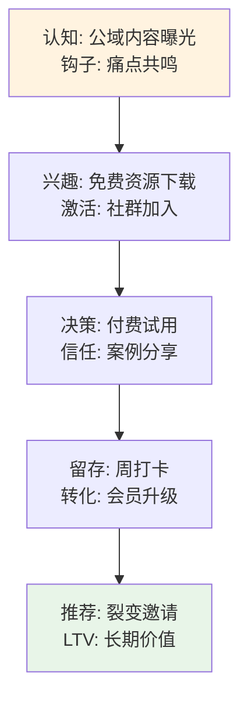

# 用户画像与痛点分析

## 新中年群体档案
- ** demographics**: 40-55岁，高净值人士（年收入>50万），城市白领/企业家。
- **心理画像**: 焦虑人生下半场，寻求财务自由、家庭平衡、自我实现。
- **行为习惯**: 微信/小红书活跃，偏好AI工具、社群学习；日均线上时长>3h。
- **来源**: 从[[千锤百问之战略篇_GMN]]衍生，基于CNNIC数据。

## 用户旅程地图
用户从认知到转化的路径：

## 核心痛点
1. **财务焦虑**: 投资波动、养老规划不足。
2. **时间碎片**: 工作家庭两头烧，缺乏系统成长路径。
3. **信息 overload**: 海量内容难辨真伪，需要AI领航。
4. **社交孤立**: 寻求同频社群，分享下半场经验。

## 解决方案匹配
- AI工具：多魔汰系统生成个性化计划。
- 社群：知识星球提供信任阶梯。

链接：[[千锤百问之战略篇_GMN]] | [[竞争格局与差异化]] | [[项目首页 - 千锤百问IP总览2.0]]

标签：#战略 #用户画像 #痛点

*更新日期：{{date}}*