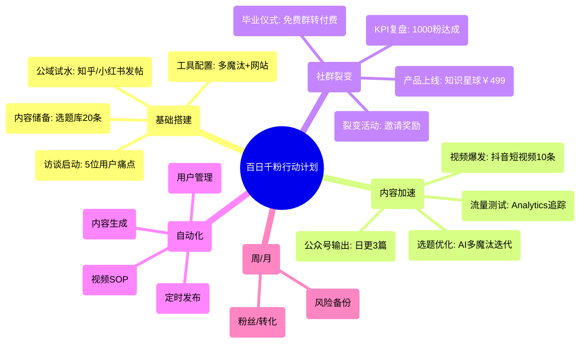

# 千锤百问.汇总v3_百日千粉行动计划脑图

## 执行概述
基于百日千粉目标，拆解月/周/日行动。核心：一核多翼（内容+社群），工具自动化。预算<300元/月，聚焦KPI：粉丝新增≥100/周，转化≥15%。

标签：#行动 #KPI #百日千粉

## 脑图

## 执行表格（月/周/日拆解）
使用Obsidian表格插件，嵌入周行示例。完整版见[[百日复盘模板]]。

| 月份 | 周次 | 日行动拆解 | 工具/资源 | KPI指标 | 预期输出 | 风险/备份 |
|------|------|------------|-----------|---------|----------|-----------|
| 月1 | 周1 | 日1: 访谈脚本准备 日2-7: 线上访谈5位 | 腾讯会议 多魔汰提示词 | 痛点收集≥10条 | 用户档案初稿 | 备用: 问卷星 |
| 月1 | 周2 | 日8-14: 公域发帖2篇/平台 | 小红书/知乎 AI生成 | 曝光≥500 | 互动评论≥20 | 算法变: 多平台 |
| 月1 | 周3 | 日15-21: 工具搭建 | rrxs.xyz网站 腾讯混元API | 配置完成 | 测试案例1 | 预算超: 免费备选 |
| 月1 | 周4 | 日22-30: 内容储备 | 选题库SOP | 20条选题 | 草稿库 | 创意枯: Bard补充 |
| 月2 | 周5 | 日31-37: 公众号日更 | 微信编辑器 RPA定时 | 粉丝增≥50 | 3篇输出 | 审核延: 预发 |
| 月2 | 周6 | 日38-44: 视频脚本+剪辑 | 剪映教程 抖音/视频号 | 播放≥1k | 10条视频 | 流量低: SEO优化 |
| ... | ... | ... | ... | ... | ... | ... |
| 月3 | 周12 | 日85-100: 最终复盘 | Analytics导入 仪表盘 | 总粉丝1000 转化15% | 迭代报告 | 全备份: Git |

链接：[[月1-基础搭建]] | [[月2-内容加速]] | [[月3-社群裂变]] | [[百日复盘模板]] | [[Canvas视图]] | [[项目首页 - 千锤百问IP总览2.0]]

*更新日期：{{date}}*