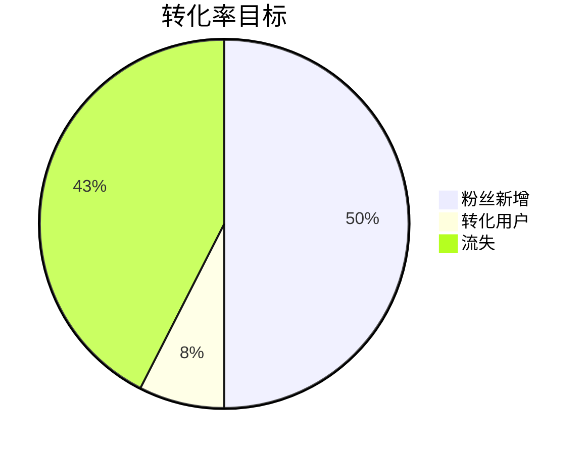

# 周/月KPI仪表盘

## 概述
周/月数据追踪：粉丝新增、转化率≥15%。使用Google Analytics导入，结合CRM数据。目标：100天1000粉，收入≥7300元。

标签：#复盘 #KPI #仪表盘

## Google Analytics数据导入
1. 登录GA4，导出报告（粉丝来源、互动、转化）。
2. 导入腾讯文档/Obsidian表格：CSV格式，字段-日期、粉丝、曝光、转化。
3. 自动化：阿里函数计算月汇总，警报转化<15%。
4. 集成：Dataview查询历史日志。

## 周KPI表格
| 周次 | 日期范围 | 粉丝新增 | 曝光/互动 | 转化率 | 收入 | 问题 | 迭代行动 |
|------|----------|----------|-----------|--------|------|------|----------|
| 周1 | 2024-01-01~07 | 0 | 0 | 0% | 0元 |  |  |
| 周2 | 2024-01-08~14 | 0 | 0 | 0% | 0元 |  |  |
| ... | ... | ... | ... | ... | ... | ... | ... |
| 周12 | 2024-03-24~30 | 0 | 0 | 0% | 0元 |  |  |

## 月KPI表格
| 月份 | 总粉丝 | 总曝光 | 平均转化 | 总收入 | 预算消耗 | 亮点 | 风险 |
|------|--------|--------|----------|--------|----------|------|------|
| 月1 | 0 | 0 | 0% | 0元 | 0元 |  |  |
| 月2 | 0 | 0 | 0% | 0元 | 0元 |  |  |
| 月3 | 0 | 0 | 0% | 0元 | 0元 |  |  |
| 总计 | 1000 | ≥100k | ≥15% | ≥7300元 | <900元 |  |  |

## 可视化（Mermaid）

链接：[[百日复盘模板]] | [[财务推演]] | [[项目首页 - 千锤百问IP总览2.0]]

*更新日期：{{date}}*