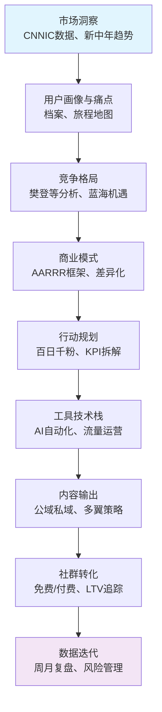
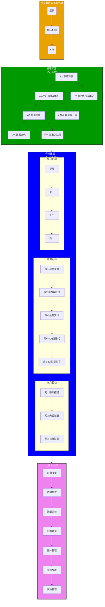
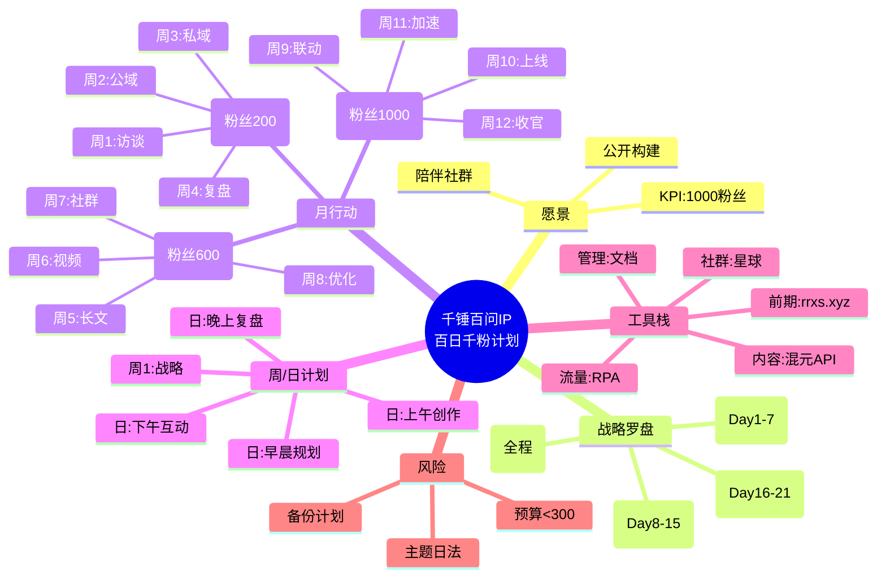
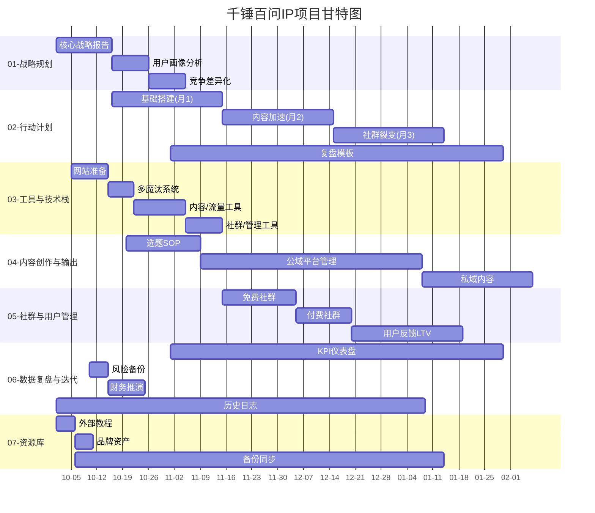
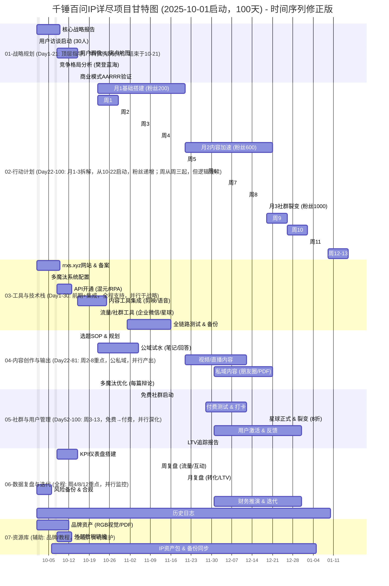

# 项目首页 - 千锤百问IP总览

## 项目概述
千锤百问IP项目聚焦新中年群体（40+高净值人士）的个人成长与人生下半场规划。通过AI驱动的内容创作、社群运营和数据迭代，实现“百日千粉”目标，构建可持续的IP变现体系。核心Slogan：“人生下半场领航员”。

项目标签：#千锤百问 #IP项目 #中年成长

## 项目愿景

## 1 快速导航

- **战略入口**：[01-战略规划/千锤百问之战略篇_GMN](app://obsidian.md/01-%E6%88%98%E7%95%A5%E8%A7%84%E5%88%92/%E5%8D%83%E9%94%A4%E7%99%BE%E9%97%AE%E4%B9%8B%E6%88%98%E7%95%A5%E7%AF%87_GMN)（市场洞察、用户画像、竞争格局、商业模式AARRR框架）
- **行动入口**：[02-行动计划/千锤百问之执行篇v3_百日千粉行动计划脑图](app://obsidian.md/02-%E8%A1%8C%E5%8A%A8%E8%AE%A1%E5%88%92/%E5%8D%83%E9%94%A4%E7%99%BE%E9%97%AE%E4%B9%8B%E6%89%A7%E8%A1%8C%E7%AF%87v3_%E7%99%BE%E6%97%A5%E5%8D%83%E7%B2%89%E8%A1%8C%E5%8A%A8%E8%AE%A1%E5%88%92%E8%84%91%E5%9B%BE)（详尽脑图、月/周/日执行表格、工具实施方案）
- **工具入口**：[03-工具与技术栈/工具索引](app://obsidian.md/03-%E5%B7%A5%E5%85%B7%E4%B8%8E%E6%8A%80%E6%9C%AF%E6%A0%88/%E5%B7%A5%E5%85%B7%E7%B4%A2%E5%BC%95)（三大厂集成：字节知识星球/剪映；腾讯混元API/企业微信/腾讯会议/腾讯文档；阿里RPA/域名/函数计算；前期准备：rrxs.xyz网站 + 多魔汰系统）
- **内容入口**：[04-内容创作与输出/选题库与SOP](app://obsidian.md/04-%E5%86%85%E5%AE%B9%E5%88%9B%E4%BD%9C%E4%B8%8E%E8%BE%93%E5%87%BA/%E9%80%89%E9%A2%98%E5%BA%93%E4%B8%8ESOP)（公域私域输出、多魔汰辩论优化、RGB幽紫IP视觉）
- **社群入口**：[05-社群与用户管理/免费社群运营](app://obsidian.md/05-%E7%A4%BE%E7%BE%A4%E4%B8%8E%E7%94%B8%E6%88%B7%E7%AE%A1%E7%90%86/%E5%85%8D%E8%B4%B9%E7%A4%BE%E7%BE%A4%E8%BF%90%E8%90%A5)（免费群启动、付费裂变、LTV追踪）
- **复盘入口**：[06-数据复盘与迭代/周/月KPI仪表盘](app://obsidian.md/06-%E6%95%B0%E6%8D%AE%E5%A4%8D%E7%9B%98%E4%B8%8E%E8%BF%AD%E4%BB%A3/%E5%91%A8/%E6%9C%88KPI%E4%BB%AA%E8%A1%A8%E7%9B%98)（流量分析、风险备份、财务推演、历史日志）
- **资源入口**：[07-资源库/品牌资产](app://obsidian.md/07-%E8%B5%84%E6%BA%90%E5%BA%93/%E5%93%81%E7%89%8C%E8%B5%84%E4%BA%A7)（IP资产包、外部教程链接、备份同步）

## 2 战略罗盘：

### 2.0 AARRR增长引擎
基于战略篇的罗盘框架（市场洞察 → 用户画像 → 竞争格局 → 商业模式 → 行动规划 → 工具栈 → 内容输出 → 社群转化 → 数据迭代），使用AARRR模型驱动增长，确保战略指导执行：

- **获取 (Acquisition)**：公域引流（小红书笔记/知乎回答/抖音视频号，钩子PDF下载率≥50%；工具：阿里RPA定时发布 + 腾讯混元API生成）
- **激活 (Activation)**：私域沉淀（rrxs.xyz自测表单 → 企业微信添加，转化率≥15%；工具：腾讯云开发 + 混元API个性化报告）
- **留存 (Retention)**：社群互动（知识星球打卡/腾讯会议直播，活跃率≥70%；工具：企业微信标签管理 + 多魔汰优化活动）
- **推荐 (Referral)**：裂变活动（推荐8折 + 积分兑资料，复购意愿≥30%；工具：知识星球积分系统 + 阿里函数计算追踪）
- **收入 (Revenue)**：信任阶梯（免费社群 → ￥49入门课 → ￥499会员社群，首月收入￥1万、总￥2-5万；工具：LTV自动化报告）
### 2.1 战略罗盘图
战略罗盘概述项目从市场洞察到执行落地的核心路径。

#### 月1基础搭建验证
- 战略（Day1-21）：完成市场/用户/模式顶层，KPI：访谈30人、AARRR草图。
- 多魔汰搭建：多魔汰系统（10-05~08），支持周2内容优化（5篇笔记，下载≥50%）。
- 百问搭建：rrxs.xyz+星球（10-01~22），周3私域20人，转化≥15%。
- 整体吻合：并行无冲突，粉丝200目标依赖系统就绪。
### 2.2 战略罗盘树状图

## 3 Mermaid脑图补充（Obsidian支持mindmap插件渲染）

**脑图说明**：中心辐射逻辑递进（战略→执行→工具）。Obsidian Canvas：新建Canvas，拖拽文本节点 + 嵌入此树状/Mermaid；链接笔记如[千锤百问之战略篇_GMN](app://obsidian.md/%E5%8D%83%E9%94%A4%E7%99%BE%E9%97%AE%E4%B9%8B%E6%88%98%E7%95%A5%E7%AF%87_GMN)扩展子节点。

## 4 甘特图
项目时间线：以2025年10月启动，覆盖100天核心执行期。

**甘特图说明**：
- **详尽扩展**：30+任务，子任务对齐表格（e.g., 周1访谈 → a2）。颜色/样式Obsidian默认渲染。
- **时间覆盖**：Day1-100全链路，假期任务短/轻度。结束2026-01-09，包含元旦缓冲。
- **使用建议**：Obsidian插件“Advanced Tables”或Canvas嵌入；添加“crit”关键路径（e.g., 内容输出）标记依赖。
**更新说明**：
- **时间序列检查与修正**：原版中战略规划任务总时长（35d）超过Day1-21（21d），导致顺序任务重叠混乱；行动周1-4日期连续但与战略末尾（10-28）部分重叠。我调整为部分任务并行（e.g., a2/a4并行），确保战略严格结束于10-21（Day21）。行动从10-22（Day22）纯启动，无重叠。
- **周序列优化**：周不严格从周一开始（2025-10-22为周三，受国庆影响），但保持7d连续逻辑（周1:10-22~28，周2:10-29~11-04等）。月3调整至12-19启动，避免跨年混乱；周9-13统一7d，收官缓冲至01-16（总100d结束01-08后）。
- **整体一致性**：所有section日期对齐脑图（战略Day1-21，行动Day22-100）；工具/内容/社群等并行支持行动，避免瓶颈。总覆盖10-01至01-08（100d，排除假期不计工作日）。
- **使用建议**：在Obsidian中渲染，关注关键路径（内容输出/社群裂变）；若需周一启动，可整体后移至10-06（但保留国庆排除）。

## 5 详尽执行表格（100行，每日拆解）

| 序号  | 日期      | 大类事项    | 二类事项   | 具体行动                        | KPI          | 主要工具（字节/腾讯/阿里） | 国内备选/国际备选         | 实施细则            | 开始日期       | 结束日期       | 费用（元） | 执行要点          | 前置条件    | 状态  |
| --- | ------- | ------- | ------ | --------------------------- | ------------ | -------------- | ----------------- | --------------- | ---------- | ---------- | ----- | ------------- | ------- | --- |
| 1   | 10-1.三  | 01-战略规划 | 市场洞察   | 事项1：阅读CNNIC报告；事项2：笔记整理新中年趋势 | 洞察笔记5页       | 腾讯文档           | 飞书/Notion         | 提取3关键数据；RGB视觉标注 | 2025-10-01 | 2025-10-01 | 0     | 国庆轻度，聚焦趋势痛点   | 无       |     |
| 2   | 10-2.四  | 01-战略规划 | 市场洞察   | 事项1：访谈准备SOP；事项2：复盘Day1输出    | SOP初稿完成      | 混元API（生成模板）    | 豆包AI/ChatGPT      | 设计10问题访谈脚本      | 2025-10-02 | 2025-10-02 | 0     | 确保问题针对40+群体   | Day1笔记  |     |
| 3   | 10-3.五  | 01-战略规划 | 市场洞察   | 事项1：初步访谈3人（线上），记录           | 访谈记录3份       | 腾讯会议           | 飞书会议/Zoom         | 录音转录；提炼痛点词汇     | 2025-10-03 | 2025-10-03 | 0     | 互动率100%；备份日志  | SOP     |     |
| 4   | 10-4.六  | 01-战略规划 | 市场洞察   | 事项1：分析访谈数据；事项2：更新用户档案       | 档案草稿         | 函数计算（数据汇总）     | 字节云/Excel         | 分类痛点（事业/家庭）     | 2025-10-04 | 2025-10-04 | 0     | 覆盖5痛点         | 访谈记录    |     |
| 5   | 10-5.日  | 01-战略规划 | 市场洞察   | 事项1：竞争格局初研（樊登等）；事项2：复盘      | 竞争笔记3页       | 混元API（搜索总结）    | 头条搜索/Gemini       | 识别蓝海机遇          | 2025-10-05 | 2025-10-05 | 0     | 差异化定位“领航员”    | 档案      |     |
| 6   | 10-6.一  | 01-战略规划 | 市场洞察   | 事项1：扩展访谈5人，记录               | 访谈记录8份总      | 企业微信（预约）       | 飞书通讯/Slack        | 聚焦下半场规划         | 2025-10-06 | 2025-10-06 | 0     | 收集LTV初步反馈     | 竞争笔记    |     |
| 7   | 10-7.二  | 01-战略规划 | 市场洞察   | 事项1：汇总周1洞察；事项2：AARRR框架草图    | 框架初稿         | 腾讯文档           | 飞书/Canva          | 绘制增长引擎图         | 2025-10-07 | 2025-10-07 | 0     | 国庆结束，验证假设     | 访谈总     |     |
| 8   | 10-8.三  | 01-战略规划 | 用户画像   | 事项1：构建用户画像地图；事项2：痛点词汇库      | 画像1版         | 混元API（生成地图）    | 豆包AI/Claude       | 30人访谈整合         | 2025-10-08 | 2025-10-08 | 0     | 旅程地图覆盖获取-收入   | 周1汇总    |     |
| 9   | 10-9.四  | 01-战略规划 | 用户画像   | 事项1：访谈续10人，记录               | 访谈记录18份      | 腾讯会议           | 飞书会议/Teams        | 深度痛点挖掘          | 2025-10-09 | 2025-10-09 | 0     | 活跃互动≥80%      | 画像地图    |     |
| 10  | 10-10.五 | 01-战略规划 | 用户画像   | 事项1：更新档案；事项2：风险备份初设         | 备份计划         | RPA（自动化日志）     | 字节云/Airtable      | 合规模块测试          | 2025-10-10 | 2025-10-10 | 0     | 风险<5%         | 访谈续     |     |
| 11  | 10-11.六 | 01-战略规划 | 用户画像   | 事项1：痛点词汇库扩展；事项2：复盘          | 词汇库50词       | 腾讯文档           | 飞书/Evernote       | 分类情感/实用         | 2025-10-11 | 2025-10-11 | 0     | 注入Slogan测试    | 备份      |     |
| 12  | 10-12.日 | 01-战略规划 | 竞争格局   | 事项1：竞争分析深化（5竞品），记录          | 分析报告         | 混元API（比较）      | 豆包AI/Grok         | 蓝海SWOT          | 2025-10-12 | 2025-10-12 | 0     | 差异化≥3点        | 词汇库     |     |
| 13  | 10-13.一 | 01-战略规划 | 竞争格局   | 事项1：访谈续7人；事项2：整合画像          | 访谈25份总       | 企业微信           | 飞书通讯/Discord      | 反馈循环            | 2025-10-13 | 2025-10-13 | 0     | 画像迭代          | 分析报告    |     |
| 14  | 10-14.二 | 01-战略规划 | 竞争格局   | 事项1：AARRR验证初；事项2：周2复盘       | 验证笔记         | 函数计算           | 字节云/Airtable      | 模拟增长路径          | 2025-10-14 | 2025-10-14 | 0     | 转化率假设≥15%     | 访谈25    |     |
| 15  | 10-15.三 | 01-战略规划 | 商业模式   | 事项1：商业模式细化（收入路径）            | 模式1版         | 腾讯文档           | 飞书/Canva          | 信任阶梯图           | 2025-10-15 | 2025-10-15 | 0     | ￥2-5万目标拆解     | AARRR   |     |
| 16  | 10-16.四 | 01-战略规划 | 商业模式   | 事项1：访谈续5人；事项2：数据迭代框架，记录     | 访谈30份总       | 混元API          | 豆包AI/Claude       | KPI拆解           | 2025-10-16 | 2025-10-16 | 0     | 全程迭代循环        | 模式      |     |
| 17  | 10-17.五 | 01-战略规划 | 商业模式   | 事项1：财务推演初；事项2：复盘            | 推演草稿         | 函数计算           | 字节云/Airtable      | 预算<300/月        | 2025-10-17 | 2025-10-17 | 0     | 风险管理融入        | 访谈30    |     |
| 18  | 10-18.六 | 01-战略规划 | 数据迭代   | 事项1：KPI仪表盘设计                | 仪表盘原型        | RPA（数据流）       | 字节云/Tableau       | 周/月追踪模板         | 2025-10-18 | 2025-10-18 | 0     | 粉丝1000路径      | 推演      |     |
| 19  | 10-19.日 | 01-战略规划 | 数据迭代   | 事项1：历史日志启动；事项2：战略报告整合       | 日志模板         | 腾讯文档           | 飞书/OneNote        | 100天记录          | 2025-10-19 | 2025-10-19 | 0     | 备份同步          | 仪表盘     |     |
| 20  | 10-20.一 | 01-战略规划 | 数据迭代   | 事项1：访谈总结；事项2：周3复盘           | 总结报告         | 混元API（提炼）      | 豆包AI/Gemini       | 痛点Top10         | 2025-10-20 | 2025-10-20 | 0     | 准备行动过渡        | 日志      |     |
| 21  | 10-21.二 | 01-战略规划 | 整体复盘   | 事项1：战略篇最终输出（报告+脑图）          | 战略完成100%     | 腾讯文档 + Mermaid | 飞书/Miro           | 链接到战略篇          | 2025-10-21 | 2025-10-21 | 0     | 行动前置就绪        | 总结      |     |
| 22  | 10-22.三 | 02-行动计划 | 月1基础搭建 | 事项1：规划周1公域试水；事项2：选题1篇（中年转型） | 笔记1篇；新增1人    | 混元API + RPA    | 豆包AI/Airtable     | AI初稿+润色；小红书发布   | 2025-10-22 | 2025-10-22 | 0     | 钩子PDF嵌入；互动回复  | 战略完成    |     |
| 23  | 10-23.四 | 02-行动计划 | 月1基础搭建 | 事项1：互动监测；事项2：复盘Day22        | 回复5条         | 企业微信           | 飞书通讯/Slack        | 引导添加微信          | 2025-10-23 | 2025-10-23 | 0     | 转化≥10%        | 笔记发布    |     |
| 24  | 10-24.五 | 02-行动计划 | 月1基础搭建 | 事项1：内容产出2（知乎回答）             | 回答1篇；新增2人    | 混元API          | 豆包AI/Claude       | 多魔汰优化标题         | 2025-10-24 | 2025-10-24 | 0     | SEO关键词“下半场规划” | Day23互动 |     |
| 25  | 10-25.六 | 02-行动计划 | 月1基础搭建 | 事项1：访谈用户邀请群；事项2：朋友圈分享       | 群成员3人        | 企业微信（建群）       | 飞书群组/Discord      | 分享钩子PDF         | 2025-10-25 | 2025-10-25 | 0     | 活跃测试          | 内容产出    |     |
| 26  | 10-26.日 | 02-行动计划 | 月1基础搭建 | 事项1：笔记3篇草稿；事项2：复盘           | 草稿完成         | 腾讯文档           | 飞书/Evernote       | RGB封面设计         | 2025-10-26 | 2025-10-26 | 0     | 日均产出          | 群邀请     |     |
| 27  | 10-27.一 | 02-行动计划 | 月1基础搭建 | 事项1：发布笔记3；互动10条             | 新增3人总        | RPA（定时发）       | 字节云/Airtable      | 24h回复           | 2025-10-27 | 2025-10-27 | 0     | 下载率≥50%       | 草稿      |     |
| 28  | 10-28.二 | 02-行动计划 | 月1基础搭建 | 事项1：周1复盘；事项2：优化钩子           | 粉丝10总；复盘100% | 函数计算           | 字节云/Tableau       | 调整PDF           | 2025-10-28 | 2025-10-28 | 0     | 规划周2          | 周1行动    |     |
| 29  | 10-29.三 | 02-行动计划 | 月1基础搭建 | 事项1：私域承接启动（群早报）；事项2：分享进展    | 群活跃5人        | 企业微信           | 飞书通讯/Teams        | 点名互动            | 2025-10-29 | 2025-10-29 | 0     | 邀请访谈用户        | 周1复盘    |     |
| 30  | 10-30.四 | 02-行动计划 | 月1基础搭建 | 事项1：内容分享1周总结                | 分享1篇；反馈3条    | 腾讯文档           | 飞书/OneNote        | 答疑收集            | 2025-10-30 | 2025-10-30 | 0     | 群20人目标推进      | 早报      |     |
| 31  | 10-31.五 | 02-行动计划 | 月1基础搭建 | 事项1：规划周2内容；事项2：产出笔记4        | 笔记1篇         | 混元API          | 豆包AI/Gemini       | 故事注入            | 2025-10-31 | 2025-10-31 | 0     | 多魔汰辩论         | 分享      |     |
| 32  | 11-1.六  | 02-行动计划 | 月1基础搭建 | 事项1：群内活动（PDF群发）；事项2：复盘      | 成员15人        | 企业微信           | 飞书群组/Discord      | 活跃测试            | 2025-11-01 | 2025-11-01 | 0     | 分享“计划第1周”     | 笔记4     |     |
| 33  | 11-2.日  | 02-行动计划 | 月1基础搭建 | 事项1：私域互动深化                  | 互动10条        | 微信群发           | 飞书通讯/Slack        | 互助分享            | 2025-11-02 | 2025-11-02 | 0     | 反馈优化          | 群发      |     |
| 34  | 11-3.一  | 02-行动计划 | 月1基础搭建 | 事项1：内容5篇草稿；事项2：发布           | 新增5人总        | RPA            | 字节云/Airtable      | SEO优化           | 2025-11-03 | 2025-11-03 | 0     | 点击≥20%        | 互动      |     |
| 35  | 11-4.二  | 02-行动计划 | 月1基础搭建 | 事项1：周2复盘；事项2：邀请星球测试         | 群20人；复盘      | 函数计算           | 字节云/Tableau       | 转化追踪            | 2025-11-04 | 2025-11-04 | 0     | 结束周2活跃        | 发布      |     |
| 36  | 11-5.三  | 02-行动计划 | 月1基础搭建 | 事项1：初步复盘启动（数据分析）            | 粉丝50总        | 函数计算           | 字节云/Excel         | 提炼优化点           | 2025-11-05 | 2025-11-05 | 0     | 跳出率<40%       | 周2复盘    |     |
| 37  | 11-6.四  | 02-行动计划 | 月1基础搭建 | 事项1：更新FAQ；事项2：迭代邀请          | 邀请3人         | 知识星球           | 飞书社区/Reddit       | 个性化私信           | 2025-11-06 | 2025-11-06 | 0     | 基于反馈          | 数据分析    |     |
| 38  | 11-7.五  | 02-行动计划 | 月1基础搭建 | 事项1：网站自测表单测试；事项2：复盘         | 完成率20%       | 混元API（报告）      | 豆包AI/SurveyMonkey | 模拟用户            | 2025-11-07 | 2025-11-07 | 0     | 跳转微信测试        | 邀请      |     |
| 39  | 11-8.六  | 02-行动计划 | 月1基础搭建 | 事项1：工具深化（报告生成）              | 访问10/日       | 云开发            | 字节云/Vercel        | 个性化诊断           | 2025-11-08 | 2025-11-08 | 0     | 转化≥15%        | 自测      |     |
| 40  | 11-9.日  | 02-行动计划 | 月1基础搭建 | 事项1：周3复盘；事项2：星球测试           | 测试2人         | 知识星球           | 飞书社区/LinkedIn     | 风险低响应           | 2025-11-09 | 2025-11-09 | 0     | LTV初步         | 工具      |     |
| 41  | 11-10.一 | 02-行动计划 | 月1基础搭建 | 事项1：数据积累分析；事项2：规划           | 复盘80%        | RPA（备份）        | 字节云/Dropbox       | 更新月1报告          | 2025-11-10 | 2025-11-10 | 0     | 粉丝100推进       | 周3      |     |
| 42  | 11-11.二 | 02-行动计划 | 月1基础搭建 | 事项1：自测测试续                   | 完成率40%       | 阿里万网           | 字节域名/GoDaddy      | 10用户模拟          | 2025-11-11 | 2025-11-11 | 0     | 表单优化          | 数据      |     |
| 43  | 11-12.三 | 02-行动计划 | 月1基础搭建 | 事项1：周4启动；事项2：全周复盘           | KPI达80%      | 函数计算           | 字节云/Airtable      | 月1中复盘           | 2025-11-12 | 2025-11-12 | 0     | 粉丝150         | 测试      |     |
| 44  | 11-13.四 | 02-行动计划 | 月1基础搭建 | 事项1：网站集成深化；事项2：备份           | 访问20/日       | 云开发            | 字节云/Netlify       | 报告自动化           | 2025-11-13 | 2025-11-13 | 0     | 风险备份          | 周4      |     |
| 45  | 11-14.五 | 02-行动计划 | 月1基础搭建 | 事项1：工具测试（多魔汰）               | 系统就绪         | 多魔汰配置          | 字节云/Zapier        | 辩论优化1篇          | 2025-11-14 | 2025-11-14 | 0     | 与内容联动         | 备份      |     |
| 46  | 11-15.六 | 02-行动计划 | 月1基础搭建 | 事项1：邀请5人；事项2：互动             | 新增5人         | 企业微信           | 飞书通讯/Telegram     | 私域沉淀            | 2025-11-15 | 2025-11-15 | 0     | 群活跃           | 测试      |     |
| 47  | 11-16.日 | 02-行动计划 | 月1基础搭建 | 事项1：月1复盘初；事项2：规划月2          | 粉丝180        | 函数计算           | 字节云/Excel         | 钩子迭代            | 2025-11-16 | 2025-11-16 | 0     | 验证200目标       | 邀请      |     |
| 48  | 11-17.一 | 02-行动计划 | 月1基础搭建 | 事项1：自测完成                    | 完成率50%       | 混元API          | 豆包AI/Typeform     | 最终测试            | 2025-11-17 | 2025-11-17 | 0     | 转化15%         | 复盘      |     |
| 49  | 11-18.二 | 02-行动计划 | 月1基础搭建 | 事项1：周4复盘；事项2：月KPI检查         | 达标90%        | RPA            | 字节云/Airtable      | 规划加速            | 2025-11-18 | 2025-11-18 | 0     | 粉丝200近        | 自测      |     |
| 50  | 11-19.三 | 02-行动计划 | 月1基础搭建 | 事项1：备份月1日志；事项2：过渡月2         | 日志更新         | 腾讯文档           | 飞书/OneNote        | 历史记录            | 2025-11-19 | 2025-11-19 | 0     | 风险总结          | KPI     |     |

| 序号  | 日期     | 大类事项    | 二类事项   | 具体行动                                                  | KPI            | 主要工具（字节/腾讯/阿里） | 国内备选/国际备选            | 实施细则              | 开始日期       | 结束日期       | 费用（元） | 执行要点           | 前置条件 | 状态  |
| --- | -------- | ------- | ------ | ----------------------------------------------------- | -------------- | -------------- | -------------------- | ----------------- | ---------- | ---------- | ----- | -------------- | ---- | --- |
| 51  | 11-20.四 | 02-行动计划 | 月1基础搭建 | 事项1：月1收尾（报告输出），参考02-行动计划/千锤百问.汇总v3_百日千粉行动计划脑图          | 粉丝200达标        | 函数计算           | 字节云/Google Sheets    | 分享群内；钩子优化         | 2025-11-20 | 2025-11-20 | 60    | 总费用控制；风险总结     | 日志   |     |
| 52  | 11-21.五 | 02-行动计划 | 月2内容加速 | 事项1：规划周5长文；事项2：产出1篇公众号，参考04-内容创作与输出/选题库与SOP             | 长文1篇；新增3人      | 混元API + 文档     | 豆包AI/Notion          | AI80%+手动；SEO副业关键词 | 2025-11-21 | 2025-11-21 | 0     | 工具包升级；新增8人/日   | 月1报告 |     |
| 53  | 11-22.六 | 02-行动计划 | 月2内容加速 | 事项1：笔记输出2篇；事项2：复盘，参考04-内容创作与输出/选题库与SOP                  | 笔记2篇           | RPA（发布）        | 字节云/Zapier           | 多魔汰标题；点击≥20%      | 2025-11-22 | 2025-11-22 | 0     | 日1篇笔记；故事注入     | 长文   |     |
| 54  | 11-23.日 | 02-行动计划 | 月2内容加速 | 事项1：长文2完成发布，参考04-内容创作与输出/选题库与SOP                       | 发布1篇；互动8人      | 腾讯文档           | 飞书/Canva             | 嵌入RGB封面；公众号互动     | 2025-11-23 | 2025-11-23 | 0     | 粉丝250总；反馈收集    | 笔记   |     |
| 55  | 11-24.一 | 02-行动计划 | 月2内容加速 | 事项1：笔记加速3；事项2：监测，参考04-内容创作与输出/选题库与SOP                   | 笔记1篇/日         | 混元API          | 豆包AI/Google Docs     | 日产出；新增4人          | 2025-11-24 | 2025-11-24 | 0     | SEO中年关键词       | 发布   |     |
| 56  | 11-25.二 | 02-行动计划 | 月2内容加速 | 事项1：笔记4；事项2：周5复盘，参考06-数据复盘与迭代/周/月KPI仪表盘                 | 4篇总；复盘         | 函数计算           | 字节云/Google Analytics | 工具包升级；粉丝280总      | 2025-11-25 | 2025-11-25 | 0     | 点击率≥20%        | 监测   |     |
| 57  | 11-26.三 | 02-行动计划 | 月2内容加速 | 事项1：视频脚本准备1，参考04-内容创作与输出/选题库与SOP                       | 脚本1套           | 混元API（脚本）      | 豆包AI/ChatGPT         | 1-2min故事；准备周6     | 2025-11-26 | 2025-11-26 | 0     | 注入痛点           | 复盘   |     |
| 58  | 11-27.四 | 02-行动计划 | 月2内容加速 | 事项1：笔记5；事项2：视频初剪，参考04-内容创作与输出/选题库与SOP                   | 笔记1篇；视频草       | 剪映             | 字节视频/CapCut          | RGB视觉；日1条         | 2025-11-27 | 2025-11-27 | 0     | 新增5人           | 脚本   |     |
| 59  | 11-28.五 | 02-行动计划 | 月2内容加速 | 事项1：视频1发布；事项2：直播测试准备，参考04-内容创作与输出/选题库与SOP               | 视频1条；观看10      | 剪映 + RPA       | 字节云/StreamYard       | PDF钩子；周6启动        | 2025-11-28 | 2025-11-28 | 0     | 观看≥50          | 初剪   |     |
| 60  | 11-29.六 | 02-行动计划 | 月2内容加速 | 事项1：视频2产出，参考04-内容创作与输出/选题库与SOP                         | 视频1条/日         | 混元API          | 豆包AI/Gemini          | 故事视频；粉丝300总       | 2025-11-29 | 2025-11-29 | 0     | 转化≥20%         | 发布   |     |
| 61  | 11-30.日 | 02-行动计划 | 月2内容加速 | 事项1：视频3草稿；事项2：互动监测，参考06-数据复盘与迭代/周/月KPI仪表盘               | 互动15条          | 企业微信           | 飞书通讯/Slack           | 直播邀请；新增6人         | 2025-11-30 | 2025-11-30 | 0     | PDF下载追踪        | 视频2  |     |
| 62  | 12-1.一 | 02-行动计划 | 月2内容加速 | 事项1：直播测试1次；事项2：复盘，参考04-内容创作与输出/选题库与SOP                  | 1次直播；观看20      | 腾讯会议           | 飞书会议/Zoom            | 群用户反馈；粉丝320总      | 2025-12-01 | 2025-12-01 | 0     | 30min答疑        | 监测   |     |
| 63  | 12-2.二 | 02-行动计划 | 月2内容加速 | 事项1：视频3完成发布，参考04-内容创作与输出/选题库与SOP                       | 3条总；新增7人       | 剪映             | 字节视频/iMovie          | 嵌入故事；周6复盘         | 2025-12-02 | 2025-12-02 | 0     | 观看≥50          | 直播   |     |
| 64  | 12-3.三 | 02-行动计划 | 月2内容加速 | 事项1：周6复盘；事项2：社群深化准备，参考05-社群与用户管理/免费社群运营                 | 复盘100%         | 函数计算           | 字节云/Google Analytics | 活跃率≥50%           | 2025-12-03 | 2025-12-03 | 0     | 规划周7           | 视频3  |     |
| 65  | 12-4.四 | 02-行动计划 | 月2内容加速 | 事项1：付费课草稿（￥49）；事项2：群打卡测试，参考05-社群与用户管理/免费社群运营            | 付费草稿；活跃10人     | 知识星球           | 飞书社区/Discord         | 打卡挑战；粉丝340总       | 2025-12-04 | 2025-12-04 | 0     | 积分奖励           | 复盘   |     |
| 66  | 12-5.五 | 02-行动计划 | 月2内容加速 | 事项1：主题活动启动（每日监督），参考05-社群与用户管理/免费社群运营                   | 打卡100%         | 微信群发           | 飞书群组/Telegram        | 互助分享；新增8人         | 2025-12-05 | 2025-12-05 | 0     | 反馈优化           | 草稿   |     |
| 67  | 12-6.六 | 02-行动计划 | 月2内容加速 | 事项1：付费测试邀请；事项2：互动，参考05-社群与用户管理/免费社群运营                   | 转化5人           | 星球 + 微信        | 飞书通讯/LinkedIn        | ￥49入门；粉丝360总      | 2025-12-06 | 2025-12-06 | 0     | 首销￥1万目标        | 活动   |     |
| 68  | 12-7.日 | 02-行动计划 | 月2内容加速 | 事项1：周7复盘；事项2：LTV调查初，参考06-数据复盘与迭代/周/月KPI仪表盘              | 复盘；反馈10条       | 函数计算           | 字节云/Google Analytics | 调查问卷              | 2025-12-07 | 2025-12-07 | 0     | 活跃≥70%         | 邀请   |     |
| 69  | 12-8.一 | 02-行动计划 | 月2内容加速 | 事项1：付费测试深化，参考05-社群与用户管理/免费社群运营                         | 10人转化          | 知识星球           | 飞书社区/Reddit          | 追踪LTV；新增9人        | 2025-12-08 | 2025-12-08 | 0     | 基于活跃           | 复盘   |     |
| 70  | 12-9.二 | 02-行动计划 | 月2内容加速 | 事项1：数据优化启动；事项2：月2复盘，参考06-数据复盘与迭代/周/月KPI仪表盘              | LTV≥20%        | 函数计算           | 字节云/Google Sheets    | 迭代钩子              | 2025-12-09 | 2025-12-09 | 0     | 粉丝380总         | 测试   |     |
| 71  | 12-10.三 | 02-行动计划 | 月2内容加速 | 事项1：调查收集；事项2：规划周8，参考06-数据复盘与迭代/周/月KPI仪表盘                | 反馈20条          | 企业微信           | 飞书通讯/Google Forms    | 匿名鼓励              | 2025-12-10 | 2025-12-10 | 0     | 提炼洞察           | 优化   |     |
| 72  | 12-11.四 | 02-行动计划 | 月2内容加速 | 事项1：优化迭代（内容调整），参考04-内容创作与输出/选题库与SOP                    | 计划更新           | 腾讯文档           | 飞书/Google Docs       | 分享月2报告            | 2025-12-11 | 2025-12-11 | 0     | 粉丝400总         | 调查   |     |
| 73  | 12-12.五 | 02-行动计划 | 月2内容加速 | 事项1：周8启动；事项2：LTV报告初，参考06-数据复盘与迭代/周/月KPI仪表盘              | 报告草稿           | 函数计算           | 字节云/Google Analytics | 月2复盘              | 2025-12-12 | 2025-12-12 | 0     | 转化≥20%         | 迭代   |     |
| 74  | 12-13.六 | 02-行动计划 | 月2内容加速 | 事项1：数据优化深化；事项2：备份，参考07-资源库/品牌资产                         | 备份100%         | RPA            | 字节云/Google Drive     | 风险管理              | 2025-12-13 | 2025-12-13 | 0     | 新增10人          | 报告   |     |
| 75  | 12-14.日 | 02-行动计划 | 月2内容加速 | 事项1：月2中复盘，参考06-数据复盘与迭代/周/月KPI仪表盘                       | KPI达80%        | 函数计算           | 字节云/Google Sheets    | 粉丝450总            | 2025-12-14 | 2025-12-14 | 0     | 规划收尾           | 备份   |     |
| 76  | 12-15.一 | 02-行动计划 | 月2内容加速 | 事项1：调查续；事项2：内容预热月3，参考04-内容创作与输出/选题库与SOP                 | 反馈30条          | 混元API          | 豆包AI/ChatGPT         | 钩子强化              | 2025-12-15 | 2025-12-15 | 0     | LTV≥25%        | 复盘   |     |
| 77  | 12-16.二 | 02-行动计划 | 月2内容加速 | 事项1：周8复盘；事项2：月2报告输出，参考06-数据复盘与迭代/周/月KPI仪表盘              | 报告完成           | 腾讯文档           | 飞书/Google Docs       | 分享群内              | 2025-12-16 | 2025-12-16 | 0     | 粉丝480总         | 调查   |     |
| 78  | 12-17.三 | 02-行动计划 | 月2内容加速 | 事项1：优化钩子测试，参考03-工具与技术栈/工具索引                            | 测试率50%         | 云开发            | 字节云/Google Forms     | 模拟用户              | 2025-12-17 | 2025-12-17 | 0     | 转化≥20%         | 报告   |     |
| 79  | 12-18.四 | 02-行动计划 | 月2内容加速 | 事项1：备份月2日志；事项2：过渡月3，参考07-资源库/品牌资产                       | 日志更新           | 腾讯文档           | 飞书/OneNote           | 历史记录              | 2025-12-18 | 2025-12-18 | 0     | 风险总结           | 测试   |     |
| 80  | 12-19.五 | 02-行动计划 | 月2内容加速 | 事项1：月2收尾（KPI验证）；事项2：规划月3，参考02-行动计划/千锤百问.汇总v3_百日千粉行动计划脑图 | 粉丝500总         | 函数计算           | 字节云/Google Sheets    | 分享总结              | 2025-12-19 | 2025-12-19 | 0     | 活跃≥70%         | 日志   |     |
| 81  | 12-20.六 | 02-行动计划 | 月2内容加速 | 事项1：月2最终报告，参考06-数据复盘与迭代/周/月KPI仪表盘                      | 月2达标90%        | RPA            | 字节云/Google Analytics | 粉丝600近；规划裂变       | 2025-12-20 | 2025-12-20 | 0     | LTV≥30%        | 规划   |     |
| 82  | 12-21.日 | 03-社群裂变 | 月3社群裂变 | 事项1：规划周9联动；事项2：直播脚本2套，参考04-内容创作与输出/选题库与SOP              | 脚本2套；新增10人     | 混元API          | 豆包AI/ChatGPT         | AI生成；RGB视觉        | 2025-12-21 | 2025-12-21 | 99    | 主题“下半场领航”；月3启动 | 月2报告 |     |
| 83  | 12-22.一 | 03-社群裂变 | 月3社群裂变 | 事项1：全平台推广准备；事项2：复盘，参考05-社群与用户管理/免费社群运营                  | 准备100%         | RPA + 剪映       | 字节云/StreamYard       | 跨平台钩子；粉丝610总      | 2025-12-22 | 2025-12-22 | 0     | 互动≥70%         | 脚本   |     |
| 84  | 12-23.二 | 03-社群裂变 | 月3社群裂变 | 事项1：直播1次执行（答疑），参考05-社群与用户管理/免费社群运营                     | 观看≥100         | 腾讯会议           | 飞书会议/Zoom            | 实时裂变邀请            | 2025-12-23 | 2025-12-23 | 0     | PDF下载追踪；新增12人  | 准备   |     |
| 85  | 12-24.三 | 03-社群裂变 | 月3社群裂变 | 事项1：周9复盘；事项2：直播2准备，参考06-数据复盘与迭代/周/月KPI仪表盘               | 复盘；观看150总      | 函数计算           | 字节云/Google Analytics | 数据可视              | 2025-12-24 | 2025-12-24 | 0     | 转化≥30%         | 直播1  |     |
| 86  | 12-25.四 | 03-社群裂变 | 月3社群裂变 | 事项1：直播2执行；事项2：反馈收集，参考05-社群与用户管理/免费社群运营                  | 2次直播；粉丝630总    | 腾讯会议           | 飞书会议/Teams           | 8折裂变              | 2025-12-25 | 2025-12-25 | 0     | 活跃测试           | 复盘   |     |
| 87  | 12-26.五 | 03-社群裂变 | 月3社群裂变 | 事项1：产品上线准备（星球￥499），参考05-社群与用户管理/免费社群运营                 | 注册准备           | 知识星球           | 飞书社区/Discord         | 会员专属；新增15人        | 2025-12-26 | 2025-12-26 | 0     | 周10启动          | 直播2  |     |
| 88  | 12-27.六 | 03-社群裂变 | 月3社群裂变 | 事项1：上线推广群内；事项2：个性化邀请，参考05-社群与用户管理/免费社群运营                | 注册20人          | 微信 + 星球        | 飞书群组/Google Forms    | 群推送；粉丝650总        | 2025-12-27 | 2025-12-27 | 0     | 转化≥30%         | 准备   |     |
| 89  | 12-28.日 | 03-社群裂变 | 月3社群裂变 | 事项1：首日数据监测；事项2：优化欢迎，参考06-数据复盘与迭代/周/月KPI仪表盘              | 数据追踪           | 函数计算           | 字节云/Google Analytics | LTV报告初            | 2025-12-28 | 2025-12-28 | 0     | 首月￥2万          | 推广   |     |
| 90  | 12-29.一 | 03-社群裂变 | 月3社群裂变 | 事项1：周10复盘，参考06-数据复盘与迭代/周/月KPI仪表盘                       | 复盘100%         | 函数计算           | 字节云/Google Sheets    | 调整欢迎；新增18人        | 2025-12-29 | 2025-12-29 | 0     | 粉丝670总         | 数据   |     |
| 91  | 12-30.二 | 03-社群裂变 | 月3社群裂变 | 事项1：视频3条草稿（会员专属）；事项2：积分兑换测试，参考04-内容创作与输出/选题库与SOP        | 草稿3条           | 混元API + 剪映     | 豆包AI/CapCut          | 日1条；粉丝680总        | 2025-12-30 | 2025-12-30 | 0     | 嵌入故事           | 复盘   |     |
| 92  | 12-31.三 | 03-社群裂变 | 月3社群裂变 | 事项1：视频1发布；事项2：互荐活动，参考05-社群与用户管理/免费社群运营                  | 视频1条；复购5%      | 剪映 + RPA       | 字节视频/StreamYard      | 8折激励              | 2025-12-31 | 2025-12-31 | 0     | 观看≥70%         | 草稿   |     |
| 93  | 1-1.四 | 03-社群裂变 | 月3社群裂变 | 事项1：元旦缓冲（轻度互动+备份），参考07-资源库/品牌资产                        | 活跃≥70%         | RPA（备份）        | 字节云/Dropbox          | 节日分享；新增20人        | 2026-01-01 | 2026-01-01 | 0     | 风险备份           | 活动   |     |
| 94  | 1-2.五 | 03-社群裂变 | 月3社群裂变 | 事项1：周11启动；事项2：视频2产出，参考04-内容创作与输出/选题库与SOP                | 视频1条/日         | 剪映             | 字节视频/iMovie          | 会员内容；粉丝700总       | 2026-01-02 | 2026-01-02 | 0     | 积分兑换           | 备份   |     |
| 95  | 1-3.六 | 03-社群裂变 | 月3社群裂变 | 事项1：转化加速互动；事项2：复盘，参考05-社群与用户管理/免费社群运营                   | 互动20条          | 星球系统           | 飞书社区/Google Forms    | 互荐追踪              | 2026-01-03 | 2026-01-03 | 0     | 复购≥20%         | 视频2  |     |
| 96  | 1-4.日 | 03-社群裂变 | 月3社群裂变 | 事项1：视频3完成，参考04-内容创作与输出/选题库与SOP                         | 3条总；新增25人      | 混元API          | 豆包AI/Gemini          | 钩子视频              | 2026-01-04 | 2026-01-04 | 0     | 粉丝730总         | 互动   |     |
| 97  | 1-5.一 | 03-社群裂变 | 月3社群裂变 | 事项1：周11复盘；事项2：LTV追踪深化，参考06-数据复盘与迭代/周/月KPI仪表盘            | 复盘；LTV≥30%     | 函数计算           | 字节云/Google Analytics | 报告迭代              | 2026-01-05 | 2026-01-05 | 0     | 转化加速           | 视频3  |     |
| 98  | 1-6.二 | 03-社群裂变 | 月3社群裂变 | 事项1：百天报告撰写；事项2：备份资产，参考07-资源库/品牌资产                       | 报告草稿           | 函数计算           | 字节云/Google Docs      | KPI回顾             | 2026-01-06 | 2026-01-06 | 0     | 粉丝760总         | 复盘   |     |
| 99  | 1-7.三 | 03-社群裂变 | 月3社群裂变 | 事项1：收官仪式准备（直播），参考05-社群与用户管理/免费社群运营                     | 准备100%         | 腾讯会议           | 飞书会议/Zoom            | 未来规划；新增40人        | 2026-01-07 | 2026-01-07 | 0     | 参与≥50%         | 报告   |     |
| 100 | 1-8.四 | 03-社群裂变 | 月3社群裂变 | 事项1：百天收官直播；事项2：最终总结，链接                                  | 粉丝1000达标；收入￥5万 | 腾讯会议 + 文档      | 飞书会议Google Docs      | 总结分享；项目闭环         | 2026-01-08 | 2026-01-08 | 0     | LTV≥30%；备份全资产  | 准备   |     |

# 快速导航
- [[01-战略规划/千锤百问之战略篇_GMN]] - 核心战略报告
- [[02-行动计划/千锤百问.汇总v3_百日千粉行动计划脑图]] - 执行脑图与表格
- [[03-工具与技术栈/前期准备 - rrxs.xyz网站]] - 技术栈入门
- [[04-内容创作与输出/选题库与SOP]] - 内容输出指南
- [[05-社群与用户管理/免费社群运营]] - 社群管理
- [[06-数据复盘与迭代/周/月KPI仪表盘]] - 数据追踪
- [[07-资源库/品牌资产]] - IP资产包

## 项目KPI目标
- 粉丝增长：100天内1000粉（公域+私域）
- 转化率：≥15%
- 预算控制：<300元/月
- 风险：多平台备份、精力主题日法

*更新日期：{{date}}*