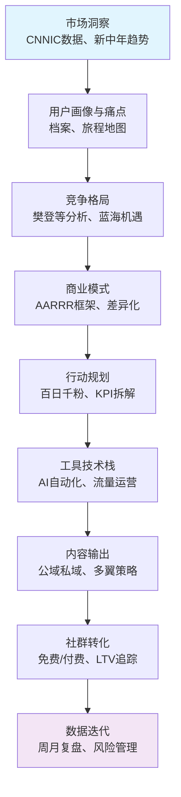
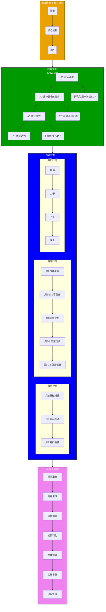

# 项目首页 - 千锤百问IP总览3.0（一人公司 & AI 智能体扩展版） <!-- 更新：版本 3.0，基于 2.0 全面融入一人公司模式和 AI 智能体系统，提升自动化和变现路径 -->

## IP 核心身份（更新版） <!-- 更新：微调品牌定位，强调一人公司被动收入 -->
- **主IP名：** 百问学长-RRXS
- **副IP名/品牌识别码：** 百问学长(RRXS)
- **品牌定位：** 专为45+、面临职业瓶颈的普通人，提供一套从零到一、可落地执行的个人品牌打造方法论。我们不是冷冰冰的课程，而是一场互相陪伴、共同成长的实战之旅。**新增：一人公司模式下，通过 AI 智能体实现被动收入，助力从 IP 粉丝到商业变现。**
- **核心Slogan：** 千锤百问，陪你把个人品牌搞定。
- **核心行动口号：** 别再瞎摸索，咱们用100天，一起搞定一人 IP 公司升华。（强调一人模式） <!-- 更新：调整口号，融入一人公司主题 -->
- **RRXS 方法论解析（扩展版）：** <!-- 更新：扩展 S - Success，融入一人公司蓝图 -->
	- **R - Research (调研):** 你的IP之旅从深度调研开始。了解市场、用户和自己的独特优势。
	- **R - Reach (触达):** 你的IP需要有效触达目标用户。这代表内容创作、渠道选择和涨粉运营。
	- **X - X-Factor (X元素/放大倍增):** 你的IP必须拥有独特的“X元素”，即你与众不同的个人故事、经验和人格魅力。
	- **S - Success (成功):** 实现商业变现、社群建立和个人价值最大化。**融入一人公司**：构建 "一人 IP 公司"（e.g., AI 自动化社群运营 + SaaS 工具销售），目标年被动收入 50 万（基于 1000 铁粉 × ￥500/年订阅）。

## 项目愿

## 1 快速导航

- **战略入口**：[01-战略规划/千锤百问之战略篇_GMN](app://obsidian.md/01-%E6%88%98%E7%95%A5%E8%A7%84%E5%88%92/%E5%8D%83%E9%94%A4%E7%99%BE%E9%97%AE%E4%B9%8B%E6%88%98%E7%95%A5%E7%AF%87_GMN)（市场洞察、用户画像、竞争格局、商业模式AARRR框架）
- **行动入口**：[02-行动计划/千锤百问之执行篇v3_百日千粉行动计划脑图](app://obsidian.md/02-%E8%A1%8C%E5%8A%A8%E8%AE%A1%E5%88%92/%E5%8D%83%E9%94%A4%E7%99%BE%E9%97%AE%E4%B9%8B%E6%89%A7%E8%A1%8C%E7%AF%87v3_%E7%99%BE%E6%97%A5%E5%8D%83%E7%B2%89%E8%A1%8C%E5%8A%A8%E8%AE%A1%E5%88%92%E8%84%91%E5%9B%BE)（详尽脑图、月/周/日执行表格、工具实施方案）
- **工具入口**：[03-工具与技术栈/工具索引](app://obsidian.md/03-%E5%B7%A5%E5%85%B7%E4%B8%8E%E6%8A%80%E6%9C%AF%E6%A0%88/%E5%B7%A5%E5%85%B7%E7%B4%A2%E5%BC%95)（三大厂集成：字节知识星球/剪映；腾讯混元API/企业微信/腾讯会议/腾讯文档；阿里RPA/域名/函数计算；前期准备：rrxs.xyz网站 + 多魔汰系统）
- **内容入口**：[04-内容创作与输出/选题库与SOP](app://obsidian.md/04-%E5%86%85%E5%AE%B9%E5%88%9B%E4%BD%9C%E4%B8%8E%E8%BE%93%E5%87%BA/%E9%80%89%E9%A2%98%E5%BA%93%E4%B8%8ESOP)（公域私域输出、多魔汰辩论优化、RGB幽紫IP视觉）
- **社群入口**：[05-社群与用户管理/免费社群运营](app://obsidian.md/05-%E7%A4%BE%E7%BE%A4%E4%B8%8E%E7%94%B8%E6%88%B7%E7%AE%A1%E7%90%86/%E5%85%8D%E8%B4%B9%E7%A4%BE%E7%BE%A4%E8%BF%90%E8%90%A5)（免费群启动、付费裂变、LTV追踪）
- **复盘入口**：[06-数据复盘与迭代/周/月KPI仪表盘](app://obsidian.md/06-%E6%95%B0%E6%8D%AE%E5%A4%8D%E7%9B%98%E4%B8%8E%E8%BF%AD%E4%BB%A3/%E5%91%A8/%E6%9C%88KPI%E4%BB%AA%E8%A1%A8%E7%9B%98)（流量分析、风险备份、财务推演、历史日志）
- **资源入口**：[07-资源库/品牌资产](app://obsidian.md/07-%E8%B5%84%E6%BA%90%E5%BA%93/%E5%93%81%E7%89%8C%E8%B5%84%E4%BA%A7)（IP资产包、外部教程链接、备份同步）

## 2 战略罗盘：

### 2.0 AARRR增长引擎
基于战略篇的罗盘框架（市场洞察 → 用户画像 → 竞争格局 → 商业模式 → 行动规划 → 工具栈 → 内容输出 → 社群转化 → 数据迭代），使用AARRR模型驱动增长，确保战略指导执行：

- **获取 (Acquisition)**：公域引流（小红书笔记/知乎回答/抖音视频号，钩子PDF下载率≥50%；工具：阿里RPA定时发布 + 腾讯混元API生成）
- **激活 (Activation)**：私域沉淀（rrxs.xyz自测表单 → 企业微信添加，转化率≥15%；工具：腾讯云开发 + 混元API个性化报告）
- **留存 (Retention)**：社群互动（知识星球打卡/腾讯会议直播，活跃率≥70%；工具：企业微信标签管理 + 多魔汰优化活动）
- **推荐 (Referral)**：裂变活动（推荐8折 + 积分兑资料，复购意愿≥30%；工具：知识星球积分系统 + 阿里函数计算追踪）
- **收入 (Revenue)**：信任阶梯（免费社群 → ￥49入门课 → ￥499会员社群，首月收入￥1万、总￥2-5万；工具：LTV自动化报告）
### 2.1 战略罗盘图
战略罗盘概述项目从市场洞察到执行落地的核心路径。

#### 月1基础搭建验证
- 战略（Day1-21）：完成市场/用户/模式顶层，KPI：访谈30人、AARRR草图。
- 多魔汰搭建：多魔汰系统（10-05~08），支持周2内容优化（5篇笔记，下载≥50%）。
- 百问搭建：rrxs.xyz+星球（10-01~22），周3私域20人，转化≥15%。
- 整体吻合：并行无冲突，粉丝200目标依赖系统就绪。
### 2.2 战略罗盘树状图

## 五大支柱 + 新增支柱六（一人公司运营） <!-- 更新：新增支柱六，详细一人公司蓝图、成本和风险防控 -->
- **支柱一：定位 (Purpose)**
	- **核心内容：** 你为何存在？你是谁，你带来什么独特价值？
- **支柱二：用户 (People)**
	- **核心内容：** 你为谁服务？深度理解你的目标受众。
- **支柱三：产品 (Product)**
	- **核心内容：** 你卖什么？打造无法抗拒的价值主张。
- **支柱四：流量 (Platform)**
	- **核心内容：** 你在哪里找到他们？你的内容与分发策略。
- **支柱五：体系 (Process)**
	- **核心内容：** 你如何交付与增长？业务背后的系统。
- **新增支柱六：一人公司运营（扩展）** <!-- 新增：完整一人公司模块，借用 AI SaaS 报告 -->
	- **核心内容：** 一人如何规模化 IP？聚焦低人力、高自动化路径。
    - **一人公司蓝图**（借用 `AI驱动SaaS系统报告`）：从 IP 内容到 SaaS 变现（e.g., "灵魂100问" AI 诊断工具，￥49/次）。初期：免费社群验证 MVP；中期：知识星球订阅 + AI 工具包销售；长期：RaaS 模式（结果付费，抽成 5-10%）。
    - **成本控制**：初始投入 <2000 元（腾讯云免费额度 + 阿里 RPA）。运营：AI 代理处理 80% 任务（内容生成、用户回复），一人日均 <2 小时。
    - **风险防控**：多角色 AI 辩论（每周复盘：杠精挑刺、专家优化），模拟 10 轮场景（技术/市场/合规），确保可持续性。

## 工具实施方案（扩展版：新增 AI 智能体系统） <!-- 更新：新增 AI 智能体子模块，详细工具栈、步骤和衔接 -->
- **总体原则**：三大厂生态集成（字节：知识星球、剪映；腾讯：混元API、企业微信、腾讯会议、腾讯文档；阿里：RPA、域名/存储/函数计算）。前期准备（Day1-7）：域名备案 + 网站搭建 + 系统配置（总时长<10小时，预算<300元/月）。无缝衔接：腾讯API调用阿里存储，企业微信联动字节知识星球。自动化覆盖率≥80%，日均手动≤2小时。备选国际工具仅限高性价比免费项（e.g., Google Analytics备选数据分析）。**新增：AI 智能体模块，一人公司自动化核心。**

- **新增子模块：AI 智能体系统（一人公司自动化核心）**： <!-- 新增：完整 AI 智能体描述，借用豆包多角色系统 -->
  - **工具栈**：腾讯混元 API（主模型，免费 1000 次/月） + LangFlow/AutoGen（低代码代理框架，免费开源） + 阿里云函数计算（自动化触发，￥0.1/万次）。
    - **多角色 AI 代理**（10 轮辩论机制）：
      - **角色定义**（借用 `豆包 AI 多角色智囊系统`）：杠精（挑刺风险）、专家（技术路径）、时间穿越（未来验证）、用户金主（价值评估）、竞争对手（壁垒分析）、第一性原理（本质回归）。
      - **应用场景**：
        1. **内容生成**：输入草稿，AI 代理辩论优化（e.g., "杠精质疑：一人公司内容太泛？专家回应：聚焦 45+ 痛点"）。周 2-3 使用，提升互动率 20%。
        2. **用户诊断**：rrxs.xyz 网站集成（表单后，AI 代理生成 "灵魂100问" 报告，个性化 IP 建议）。
        3. **运营监控**：每日复盘（代理分析 KPI：粉丝增长/转化，模拟风险如 "一人 overload"）。
        4. **变现自动化**：社群内 AI 代理回复（企业微信集成），沉默用户激活（RPA + 代理私信）。
    - **实施步骤**（Day 1-7，前期准备扩展）：
      1. Day 1-2：配置 API（腾讯混元 + LangFlow 免费部署）。
      2. Day 3-4：设计 Prompt 模板（Notion 存储，10 轮辩论脚本）。
      3. Day 5-7：测试（e.g., 输入 IP 选题，输出优化文案 + 风险报告）。集成到 SOP（周 1 战略复盘必跑）。
    - **成本/效率**：免费额度覆盖（月 <500 次调用）；一人节省 70% 时间（从手动辩论到 AI 自动化）。KPI：方案赢率 ≥90%（辩论后迭代）。
    - **一人公司适配**：代理模拟 "虚拟团队"，避开人力瓶颈（e.g., 杠精模式防控 "一人决策盲区"）。

- **与现有工具衔接**： <!-- 更新：明确衔接点 -->
  - **内容生成**：混元 API + AI 代理（替换 ChatGPT，辩论优化初稿）。
  - **流量运营**：阿里 RPA 触发代理（e.g., 定时分析 Google Analytics 数据，输出复盘报告）。
  - **社群转化**：知识星球 + 代理（自动生成用户专属诊断，转化率 ≥15%）。

## 百日千粉行动计划（扩展版） <!-- 更新：新增步骤和 KPI，融入 AI 智能体和一人效率 -->
- **月 1（基础搭建）**：新增 Day 8-10：搭建 AI 智能体原型（测试 3 轮辩论，优化 IP 简介）。KPI：代理输出 5 篇内容草稿。
- **月 2（内容加速）**：周 5-6：用代理自动化笔记/视频脚本（一人审阅）。新增 KPI：自动化率 ≥50%，粉丝转化 +10%。
- **月 3（社群裂变）**：周 10-12：代理处理群互动（e.g., 个性化回复），启动 "一人 IP 公司" MVP（AI 工具包销售，￥99/月）。目标：被动收入验证（10 用户订阅）。
- **整体 KPI 更新**：新增 "一人效率"（日手动 <2 小时）；风险辩论覆盖率 100%（每周 1 轮）。
