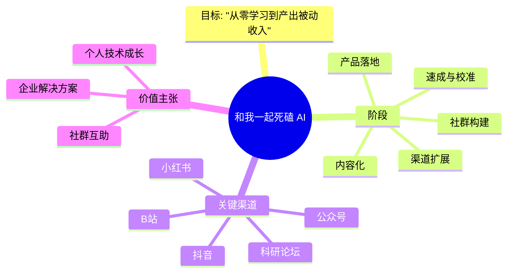
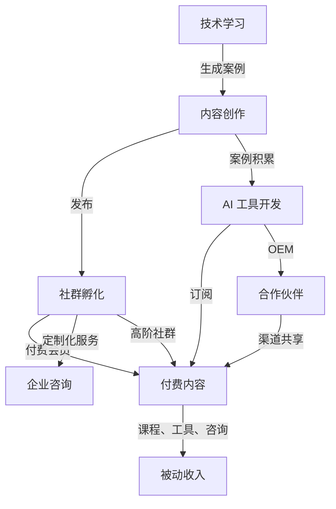

## 📌 方案概览：**“和我一起死磕 AI”** – 个人成长 → 内容共享 → 被动收入

> **目标**：在掌握 AI 基础与实战的同时，以内容与社群为载体，构建一个可持续的被动收入生态。
> **核心价值**：从“技术菜鸟 → 产能型知识创造者”转变，利用已有的销售与工业品营销经验，快速搭建社群与内容产品。

---

### 1️⃣ 个人 SWOT 速推

|  | 优势 | 劣势 | 机会 | 威胁 |
|---|---|---|---|---|
| **个人背景** | 10 年家电 & 元器件销售+市场经验 熟悉 B2C/B2B 渠道运营与品牌建设 已运营小红书/抖音账号 | AI 入门水平 社群运营经验有限 | AI 课程与工具需求旺盛 国内教育技术与创业生态成熟 | 竞争对手多（线下/线上） 政策 / VPN 限制 |
| **技术能力** | 具备数据驱动思维 熟悉产品迭代 | 对深度学习 & 大模型细节不熟 | 国内 AI 社区活跃，可快速学习 | 监管政策可能影响内容分发 |
| **渠道** | 小红书、抖音、微信公众号已有粉丝基数 可借助现有 B2C/工业品渠道 | 流量停滞 | 结合行业热点（工业 AI、智能硬件） | 同类 AI 账号增多，内容同质化 |

> **结论**：最核心机会是将 “技术学习 + 市场敏锐度” 结合成可付费内容与工具。
> **行动起点**：先补齐技术壁垒，随后快速落地“知识产品 → 社群 → SaaS 工具”。

---

## 2️⃣ 业务蓝图（Business Model Canvas）

| 组成要素 | 具体实现 | 价值主张 |
|---|---|---|
| **关键合作** | OpenAI、腾讯云、阿里云、行业协会、校园 | 降低技术门槛 |
| **关键活动** | AI 技术学习、内容创作、产品原型、社区运营 | 塑造知识共享机制 |
| **关键资源** | GPT‑4 API、已有社群、营销渠道、工业产品案例 | 形成内容与产品双轮驱动 |
| **价值主张** | “零基础 30 天 AI 学成，并可在工业/家电领域落地” | 帮助同样背景的从业者快速上手 |
| **客户关系** | 线下线索、线上社群、VIP 订阅 | 形成长期互动 |
| **渠道** | 小红书、抖音、公众号、知乎、B站、企业邮箱 | 多维度触达 |
| **客户细分** | 50+ 经验技术人、企业决策者、行业新人 | 满足多层次需求 |
| **收入来源** | ① 线上课程 (单次/订阅) ② 高阶会员社群 ③ 企业定制咨询 ④ SaaS 工具订阅 ⑤ 广告/品牌合作 | 渐进式收入模型 |
| **成本结构** | 内容制作费、API 费用、广告投放、人力资源 | 均衡投入产出 |
| **未形成本** | 法律合规、VPN 维护 | 需要持续监控 |

---

## 3️⃣ 详细行动路线图（分阶段）

| 阶段 | 时长 | 目标 | 关键动作 | KPI |
|---|---|---|---|---|
| **① 速成与校准** | 1–3 个月 | 建筑技术基础+案例库 | • 报名线上大模型速成课程 • 每周完成 1 份案例分析 • 利用家电/工业品项目记录应用 | ① 技能等级提升 ② 案例库 >10 项 |
| **② 内容化** | 3–6 个月 | 产出 4 期“死磕 AI”系列 | • 每月 2 篇优质文章 • 2 次直播/短视频教程 • 建立小红书/抖音专属标签 | ① 粉丝流量 +250% ② 评论转化率 >5% |
| **③ 社群构建** | 6–9 个月 | 成功孵化 200+ 会员（30% 高阶） | • 开通微信群/QQ群 • 设立 VIP 订阅 • 定期线上研讨 | ① 社群活跃度 30% ② 留存率 70% |
| **④ 产品落地** | 9–12 个月 | 发布首款 AI 工具（B2B 案例） | • 设计可视化 AI 流程图工具 • 内测 20 家企业 • 订阅制上线 | ① 收入 >200K RMB/年 ② 客户 NPS >8 |
| **⑤ 渠道扩展** | 12–18 个月 | 形成多元化收入网络 | • 与高校/行业协会合作 • 争取政府培训项目 • 争取国内大厂 API 合作 | ① 30% 收入来自企业 ② 1 份合作协议 |

> **备注**：每阶段完成后做一次“复盘 + 调整”，确保项目与市场需求同步。

---

## 4️⃣ 可视化（思维导图、流程图）

> 由于文本限制，以下使用 **Mermaid** 语法提供可直接复制到 VSCode / Markdown 编辑器中渲染的图示。

### 4.1 思维导图（概要）

### 4.2 流程图（商业模型）

> 你可以将上方 Mermaid 代码复制到 `https://mermaid.live/` 或相应 Markdown 编辑器中查看渲染效果。

---

## 5️⃣ 市场 & 竞争分析

| 竞争对手 | 主要产品 | 价值主张 | 机会点 |
|---|---|---|---|
| 1. OpenAI 公开课程 | GPT‑4 API、ChatGPT | 强大技术支撑 | 通过“定制化案例”差异化 |
| 2. 慕课网、Udemy | 传统 AI 课程 | 公开课低门槛 | 为同龄人提供“本土化”案例 |
| 3. 企业内部培训 | 内部 AI 培训 | 高度专业化 | 针对工业品与元器件领域的应用场景 |
| 4. “技术大咖”自媒体 | 个人经验分享 | 个人品牌 | 可借鉴内容形式 & 社群运营 |

**差异化**
- **行业深度**：利用多年工业品经验，量身定制 “AI+家电/工业品” 实战案例。
- **社区体验**：以 50+ 经验人群为核心，提供“老带新”成长路径，增加粘性。
- **产品落地**：打造可视化 AI 工具，直接解决企业业务痛点。

---

## 6️⃣ 市场推广 & 成长策略

| 维度 | 策略 | 预期效果 | KPI |
|---|---|---|---|
| **内容 | 1. 每周 1 篇深度案例 2. 每月 1 次直播 3. 与行业名人合作 | 内容可持续、品牌曝光 | Follower 增长率 50% / 月 |
| **社群 | 1. 开设 “技术沙龙” 2. 组织线下 MeetUp 3. 周期性项目评测 | 增强忠诚度、提高转化 | 会员复购率 30% / 年 |
| **广告 | 1. 竞价推广（小红书/抖音） 2. 赞助行业论坛 | 快速拉新、提高转化 | CAC < 100 元 |
| **合作 | 1. 与高校/科研院所合作课程 2. 牵手企业做案例 | 扩大覆盖、增加收入 | 合作项目 > 10 项 |
| **SEO | 关键词：AI 学习、智能硬件 AI、工业 AI 解决方案 | 长期有机搜索流量 | Organic Traffic 2% 提升 |

---

## 7️⃣ 关键资源与预算估算（12 个月）

| 资源 | 预算 (RMB) | 备注 |
|---|---|---|
| GPT‑4 API | 120k | 30 天 × 4k tokens/日 |
| 内容制作 | 50k | 包括视频后期、图文编辑 |
| 广告投放 | 70k | 小红书 + 抖音 |
| 社群运营 | 30k | 服务器、社群管理工具 |
| 产品研发 | 80k | 前端后端开发、UI 设计 |
| 法律合规 | 10k | 合同、隐私政策 |
| VPN + 服务器 | 25k | 1 年 |
| **合计** | **345k** | 约 28 万元 |

> 可按阶段拆分：
> - **阶段 1–3**：技术学习 + 低成本内容（预算 80k）
> - **阶段 4–6**：社群 + 加大广告（预算 60k）
> - **阶段 7–12**：产品开发 + 扩大合作（预算 205k）

---

## 8️⃣ 收益模型 & 现金流预测（按年）

1. **课程单次付费**：12 月 10 期 × 200 人 × 300 RMB = 720k
2. **订阅社群**：200 人 × 100 RMB/月 × 12 = 240k
3. **企业定制咨询**：5 项 × 30k = 150k
4. **AI 工具订阅**：30 家 × 2k/月 × 12 = 720k
5.